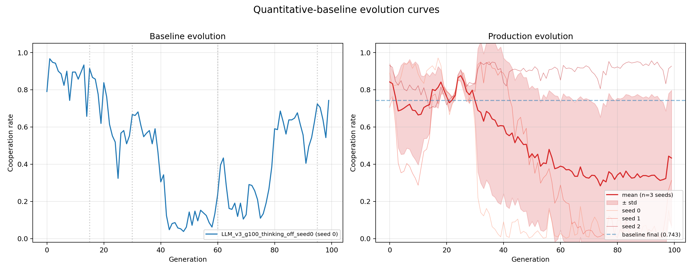
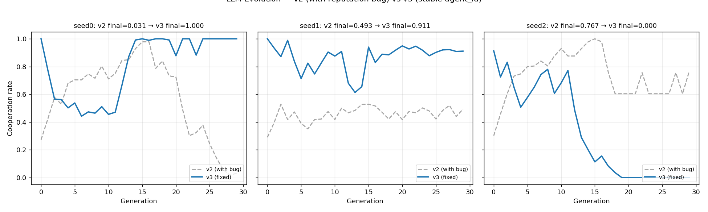
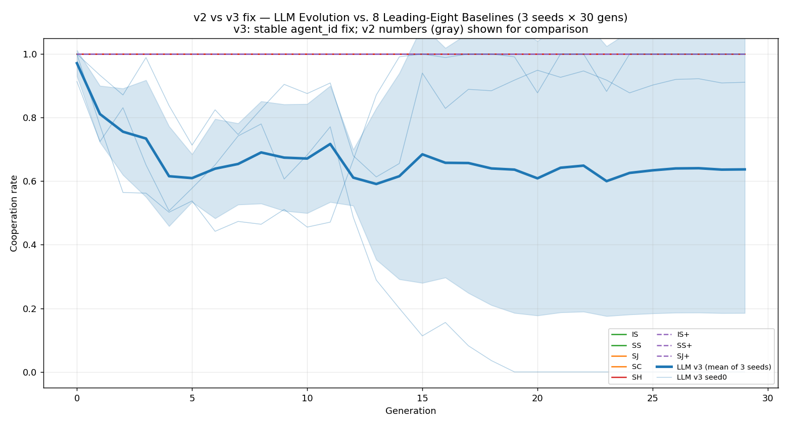

# LLM-Driven Evolution of Reputation Algorithms

This repository contains the experimental code and paper artifacts for
studying cooperation in LLM-coded populations with private reputation stores,
quantitative assessment, and controlled observability.

## Requirements

- Python 3.12 or newer
- [`uv`](https://docs.astral.sh/uv/)
- A DeepSeek API key for LLM-generating experiments

The API configuration is loaded from a root-level `.env` file. Start from
`.env.example` and keep `.env` local; it is ignored by Git.

## Install

From the repository root:

```powershell
uv sync
```

The project dependencies and executable entry points are defined in
`pyproject.toml`, with versions locked in `uv.lock`.

## Project layout

```text
.
├── experiments/
│   ├── agents/              # Agent interfaces and LLM prompts
│   ├── analysis/            # Analysis and visualization modules
│   ├── config/              # YAML settings and environment loading
│   ├── evolution/           # Evolutionary population code
│   ├── game/                # Quantitative reputation games
│   ├── sandbox/             # Strategy validation and execution
│   ├── tools/               # Re-run orchestration
│   ├── run_fermi_v3.py      # CLI entry for the v3 Fermi evolution experiment
│   └── v2_quantitative/     # Quantitative-assessment engine
├── results/                 # Experiment outputs and figures
├── PAPER_DRAFT.md
├── pyproject.toml
└── uv.lock
```

The Agent 2 invasion runner and dashboard are maintained under
`experiments.analysis.invasion` and `experiments.analysis`, respectively.
Analysis commands resolve project-relative result directories at runtime;
paths can be overridden with explicit CLI options.

The baseline-versus-production evolution plot is provided by
`experiments.analysis.plot_evolution_curves` and writes PNG/PDF figures under
`results/quantitative_baseline/plots/` by default.

## Common commands

The configured project scripts can be run with `uv run`:

```powershell
# Main legacy donor-game CLI
uv run llm-reputation --help

# Audit or re-run the documented experiment batches
uv run rerun-experiments --audit
uv run rerun-experiments --experiments 2 --seeds 0 1 2

# Agent 2 invasion experiment (336 fixed-strategy runs by default)
uv run run-agent2-invasion --help

# Generate the invasion dashboard
uv run plot-agent2-invasion

# Plot cooperation evolution curves
uv run plot-evolution-curves

# Generate legacy paper figures and summary tables
uv run make-figures --help

# Plot lineage survival and final-survivor trees
uv run plot-lineage --help

# v3 Fermi-style LLM evolution experiment (see section below)
uv run python -m experiments.run_fermi_v3 --help
```

The same commands are available through module execution, for example:

```powershell
uv run python -m experiments.analysis.plot_agent2_schmid_invasion
uv run python -m experiments.analysis.plot_evolution_curves
uv run python -m experiments.analysis.make_figures --help
uv run python -m experiments.analysis.plot_lineage --help
uv run python -m experiments.run_fermi_v3 --dry-run --seed 0
```

`uv run` requires a command or module; there is no single implicit default
task for this project.

## Agent 2 bidirectional invasion experiment

The current invasion study uses the evolved `agent_id=2` strategy from
generation 99 of the seed-2 production run against the four norms identified
by Schmid et al. (2023) as robust under quantitative assessment with private
and noisy information: `L1`, `L2`, `L7`, and `L8`.

The runner uses:

- `N=15`, 50 generations, and seeds `0, 1, 2`;
- exactly 1,000 pair interactions per generation;
- the first 800 interactions as burn-in;
- the final 200 interactions for selection fitness;
- benefit `b=2`, cost `c=1`, full observation, and observer-private reputations;
- synchronous fixed-strategy Fermi imitation with `beta=5` and 15 updates per generation;
- both directions: Agent 2 invading a norm and a norm invading Agent 2;
- initial invader counts `n=1..14`.

Run or resume the experiment with:

```powershell
uv run run-agent2-invasion
```

Completed JSON files are cached, so re-running resumes without repeating
finished cells. Use `--smoke` for a small validation run, or `--help` for
selection of norms, directions, seeds, and output paths.

Results are written under:

```text
results/quantitative_baseline/invasion/
└── agent2_schmid_L1_L2_L7_L8_mainmatched/
    ├── summary.json
    ├── agent2_schmid_bidirectional_invasion_dashboard.png
    ├── agent2_invades_norm/<norm>/n<k>_seed<s>/invasion.json
    └── norm_invades_agent2/<norm>/n<k>_seed<s>/invasion.json
```

Generate the dashboard again with:

```powershell
uv run plot-agent2-invasion

# Equivalent module form:
uv run python -m experiments.analysis.invasion.run_agent2_schmid_invasion --help
```

The plotting module validates that all 336 formal result files exist, that
every trajectory uses the `1000/800/200` interaction split, and that the four
norms have matching population-frequency trajectories before producing the
figure.

## v3 Fermi-style LLM evolution experiment

The entry point `experiments/run_fermi_v3.py` is a command-line launcher for
the v3 (full `LLMAgent` class) population evolution with the Fermi imitation
selection scheme. It is a thin CLI wrapper over
`experiments.v2_quantitative.population.V2EvolutionaryPopulation` and mirrors
the production-run script `_run_fermi_3seed_100gen_v3.py` at the repo root.

Run a single seed:

```powershell
uv run python -m experiments.run_fermi_v3 --seed 0 --gens 100 --target-interactions 1000
```

Run multiple seeds sequentially (default is seeds `0 1 2`):

```powershell
uv run python -m experiments.run_fermi_v3 --seeds 0 1 2
```

Preview the run plan without touching the API:

```powershell
uv run python -m experiments.run_fermi_v3 --dry-run --seeds 0 1 2
```

Common options:

| Option | Default | Description |
| --- | --- | --- |
| `--seed N` / `--seeds N...` | `[0, 1, 2]` | Seed(s) to run; `--seed` overrides `--seeds` |
| `--gens N` | `100` | Number of generations |
| `--target-interactions N` | `1000` | Target PD interactions per generation |
| `--population-size N` | `15` | Population size |
| `--updates-per-gen N` | `15` | Fermi imitation updates per generation |
| `--fermi-beta F` | `5.0` | Fermi selection strength |
| `--mutation-rate F` | `0.1` | Mutation probability on adoption (`mu`) |
| `--mutation-temperature F` | `0.8` | LLM mutation temperature |
| `--benefit F` / `--cost F` | `2.0` / `1.0` | PD payoffs |
| `--observability S` | `full` | Observability mode |
| `--provider S` | `deepseek` | API provider for key/base-url lookup |
| `--model S` | provider default | LLM model name |
| `--llm-thinking` | off | Enable LLM thinking mode |
| `--agent-type {v2,v3}` | `v3` | Agent family to evolve |
| `--label S` | `LLM_v3_fermi_z_v3_g100_1000inter` | Output directory / summary label |
| `--output-root PATH` | `results/quantitative_baseline` | Root for per-seed result folders |
| `--dry-run` | off | Validate and print the seed plan without running |

Per seed, results are written to
`<output-root>/<label>_seed<s>/evolutionary.json`, and a combined
`<label>_summary.json` is written after each seed completes. The launcher reads
API keys from `.env` via `experiments.config.load_env` and exits non-zero if a
seed fails.

## Re-running the original experiment batches

The orchestration tool documents the earlier donor-game and IPD comparison
experiments:

```powershell
uv run rerun-experiments --audit
uv run rerun-experiments --experiments 1 --seeds 0 1 2
uv run rerun-experiments --experiments 2 --seeds 0 1 2
uv run rerun-experiments --experiments 3 --seeds 0 1 2
uv run rerun-experiments --experiments 4 --seeds 0 1 2
uv run rerun-experiments --experiments 5 --seeds 0 1 2
```

See [`experiments/tools/README.md`](experiments/tools/README.md) for the
full batch plan and trial-specific options.

## Key references

- Schmid, L., Ekbatani, F., Hilbe, C. & Chatterjee, K. (2023).
  *Quantitative assessment can stabilize indirect reciprocity under imperfect
  information.* Nature Communications 14, 2086.
- Ohtsuki, H. & Iwasa, Y. (2006).
  *The leading eight: Social norms that can maintain cooperation by indirect
  reciprocity.* Journal of Theoretical Biology 239, 435–444.
- Willis, R., Du, Y., Leibo, J. Z. & Luck, M. (2025).
  *Will Systems of LLM Agents Cooperate: An Investigation into a Social
  Dilemma.* arXiv:2501.16173.

## Repository status

- Core experiment and re-run tooling are implemented.
- The Agent 2 / Schmid L1–L2–L7–L8 bidirectional invasion runner is implemented
  and has completed 336 runs.
- The package exposes `uv run` entry points for the main CLI, re-run tool,
  invasion runner, and invasion dashboard.
- Paper drafts and supplementary artifacts remain under active development.

---

## Demo

This section is a compact, presentation-ready summary of the current experimental
results. The key idea is that the LLM-generated strategies do not behave like a
single fixed algorithm; instead, they evolve into a family of attractors whose
stability depends strongly on the seed and on the implementation details of the
reputation update logic.

### 1) Baseline vs. production evolution

The first figure compares the baseline trajectory with the production LLM-evolution
runs:

- [results/quantitative_baseline/plots/evolution_curves.png](results/quantitative_baseline/plots/evolution_curves.png)

Interpretation:

- The blue baseline curve remains relatively stable and stays near the high-cooperation
  regime, indicating that the canonical rules and the controlled environment provide a
  strong cooperative attractor.
- The red production curves from the three LLM seeds are much noisier and more variable.
  Some seeds drift upward, some oscillate, and some fall into lower-cooperation states.
- The overall mean is still well above the low end of the spectrum, but the width of the
  spread shows that LLM-evolved strategies are not uniformly stable: they can succeed,
  fluctuate, or fail depending on the random seed and mutation path.

This tells us that the evolutionary search is capable of discovering cooperative
policies, but the final outcome is seeded and path-dependent rather than guaranteed.

### 2) v2 vs. v3: the bug fix materially changes the outcome

The second figure isolates the effect of the reputation-store and agent-identity fix:

- [results/quantitative_baseline/plots/llm_only.png](results/quantitative_baseline/plots/llm_only.png)

Interpretation:

- For seed 0, the v3 curve rises strongly and ends near a full-cooperation regime,
  while the earlier v2 version collapses to a much worse state. This is a large
  qualitative improvement.
- For seed 1, v3 is again better than v2 and remains in the cooperative neighborhood
  for most of the run, although it still does not reach the perfect attractor.
- For seed 2, the story flips: v2 is relatively better in the middle of the run, but
  v3 ends in a sharp collapse to near zero cooperation. This is not a contradiction;
  it shows that the fixed implementation makes the dynamics more sensitive to the
  actual evolved strategy, exposing a much more decisive basin structure.

In other words, the v3 fix does not simply "improve all runs." It removes hidden
mechanical errors and exposes the underlying evolutionary structure: the LLM can
strongly converge to good norms in some seeds, but it can also converge to a bad
all-defection basin in others.

### 3) LLM evolution versus the leading eight

The third figure compares the LLM runs against the canonical leading-eight norms:

- [results/quantitative_baseline/plots/overview.png](results/quantitative_baseline/plots/overview.png)

Interpretation:

- All eight leading-eight strategies stay at or near cooperation rate 1.0 across the full
  horizon. Their behavior is highly stable and robust.
- The LLM v3 trajectories are visibly less reliable: they eventually move toward the
  cooperative basin, but with larger fluctuations and seed-dependent variance.
- The result is not that the LLM is always worse; rather, it is that the LLM can match
  the cooperative attractor in favorable seeds but cannot yet match the textbook baselines'
  consistency and reliability across seeds.

This is the central empirical message of the project:

- the LLM is capable of generating reputation-evaluation algorithms that can move into
  high-cooperation regimes,
- but the exploration process remains stochastic and fragile,
- and the resulting strategies are not yet as robust as classical indirect-reciprocity
  norms under the same experimental conditions.

### 4) Short takeaway

Taken together, the figures support the following narrative:

1. The environment is cooperative-friendly when the rules are well-formed.
2. The LLM can discover strong cooperative policies, but only in a subset of evolutionary
   trajectories.
3. The v3 fix changes the observed dynamics substantially, revealing a more bimodal
   structure: success in some seeds, collapse in others.
4. The leading-eight baselines remain the reliability benchmark: they are stable
   attractors, whereas learned LLM strategies are promising but less robust.

This is exactly the kind of result a demo section should emphasize: the figures show not
only whether cooperation emerges, but also whether the emergence is stable, reproducible,
and comparable to known theoretical mechanisms.

To make the experimental story concrete, the same narrative can be read directly from the
embedded figures below. They are intentionally placed within the Demo section so the reader
sees the result progression as a single argument: first the overall dynamics, then the v2-v3
comparison, and finally the structural view of how the strategy population moves in embedding
space.



Figure: baseline vs. production cooperation trajectories. The blue curve reflects the stable
reference behavior, while the red curves show three independent LLM-evolved seeds. The spread
is the point: some seeds converge cleanly, some fluctuate, and some collapse, which is exactly
what we want to highlight in a genuine evolutionary story rather than a single smooth mean.



Figure: v2 vs. v3 comparison for the LLM-only runs. The corrected implementation changes the
landscape materially: the updated system reveals a more bimodal outcome, with some seeds
improving sharply while others settle into a low-cooperation basin. This is not a simple
"better or worse" story; it is a case where the implementation details directly shape the
attractor structure.



Figure: canonical leading-eight norms versus the LLM trajectories over the same horizon. The
classical strategies remain nearly perfectly stable, while the evolved LLM policies remain
seed-sensitive and less reliable. This contrast makes the main scientific result clear: the LLM
can discover cooperation, but it does not yet match the robustness of the classical norms.

The next layer of evidence comes from the shared-code embedding plots, which show how the
population rearranges itself over generations rather than only reporting the scalar cooperation
rate. These are the visualizations that explain why the same overall task can lead to different
attractors depending on seed and implementation details.


This stacked composition view shows that the v3 population is not drifting randomly; it forms
coherent groups across generations. The emergence of persistent structure indicates that the
LLM is not just mutating code at random, but is repeatedly converging toward a small set of
stable behavioral archetypes.


The PCA animation makes that convergence concrete: the population moves through embedding space
as a structured cloud and then settles into a much smaller region. In other words, the code is
not merely changing superficially; it is reorganizing into recognizable cooperative patterns.

For comparison, the v2 version of the same representation shows the older dynamics before the
reputation bookkeeping fix. The cluster structure is less decisive and the latent motion is more
diffuse, which is consistent with the observation that the earlier implementation masked the true
attractor geometry.


The short video below makes the same point in motion and is useful as a live demo asset during
presentations or walkthroughs.

<video controls width="960" poster="README.assets/overview.png">
  <source src="README.assets/v3_3seed_shared_codeemb/seed0/plot_strategy_pca_evolution.mp4" type="video/mp4">
  Your browser does not support the video tag.
</video>

Taken together, the figures form one continuous narrative: the environment supports cooperation,
the LLM can discover cooperative strategies, the corrected implementation changes the attractor
structure, and the leading-eight norms remain the robustness benchmark. That is the core demo
story this repository is meant to communicate.

---
