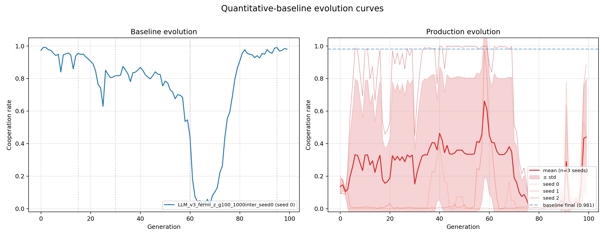
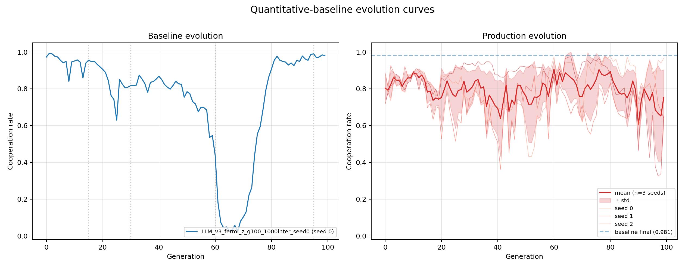
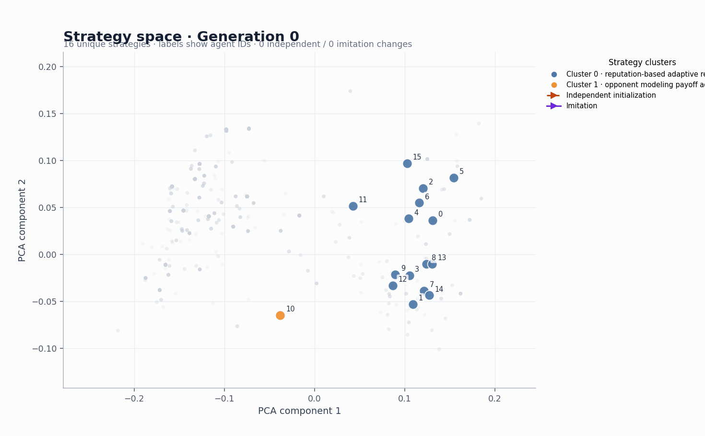
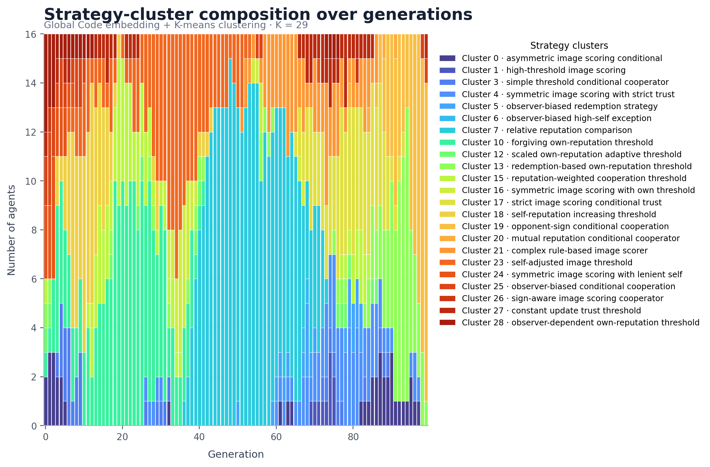
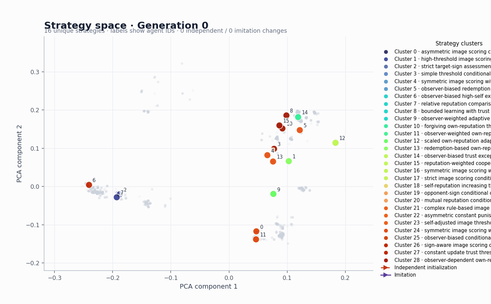
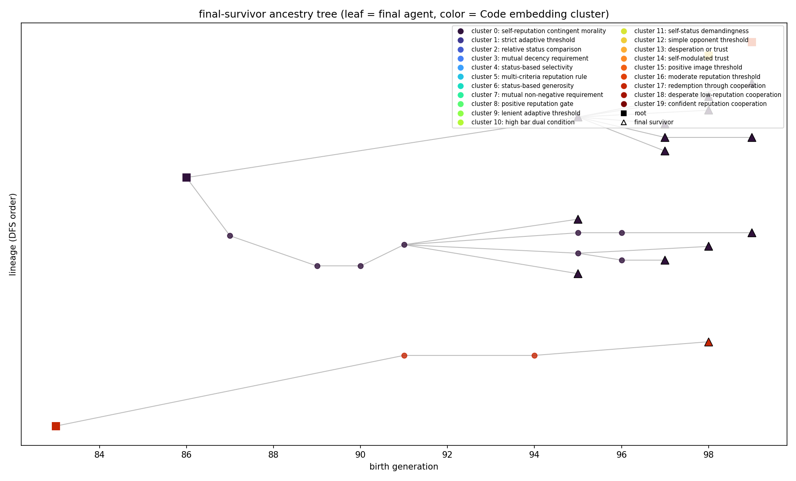
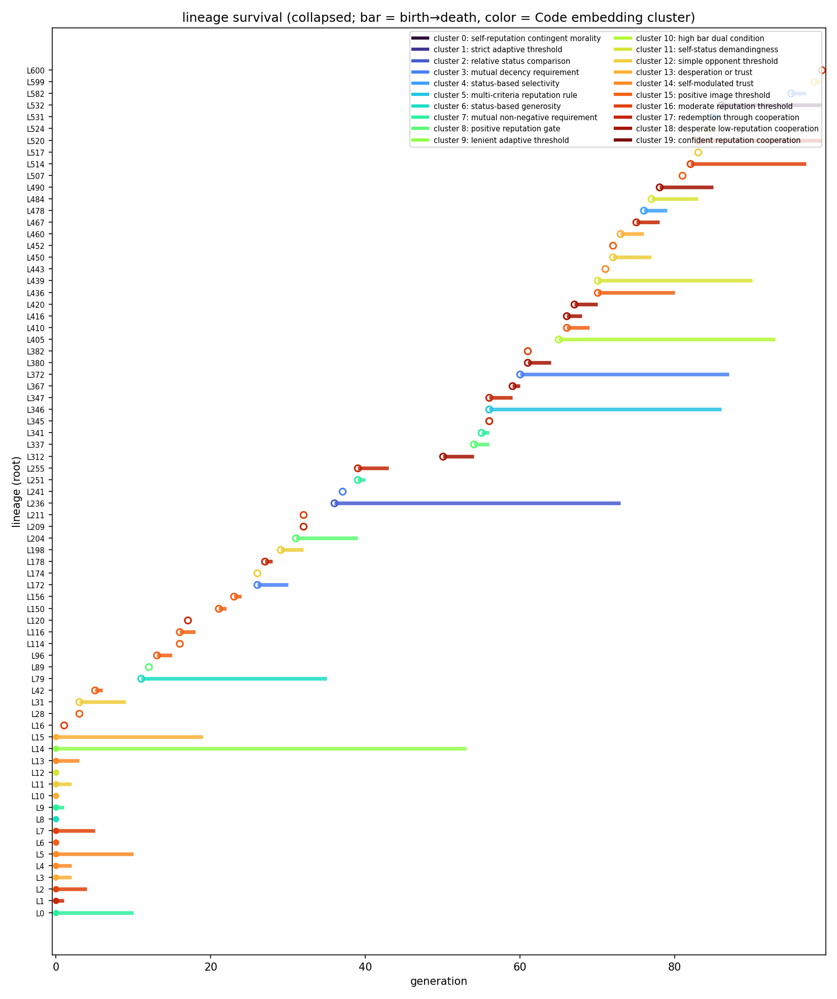

# LLM-Driven Evolution of Reputation Algorithms


## Demo

A compact research showcase of how LLM-evolved strategies behave in reputation-driven cooperation games.

The core result is that cooperation can emerge from LLM-generated strategies, but the outcome is strongly seed-dependent and sensitive to the implementation details of the reputation logic. Classical indirect-reciprocity norms remain more stable, while learned strategies are promising but less robust.

### 1) Fresh six-run evolution curves


This uses the newest six-run experiment curves rather than the older single-summary plot. The blue reference remains near the cooperative attractor, while the new production trajectories show stronger seed-to-seed variability and a clearer multi-basin pattern across the full run.

### 2) v2 vs. v3: different prompt structures, different search dynamics



V2 uses a compact two-function prompt: the model writes an `evaluate(...)` function and a `decide(...)` function under a fully specified interface. The prompt is explicit about the game and the output contract, so the search space is narrower and more direct.



V3 instead asks for a full `LLMAgent` class with `__init__`, `decide()`, and `observe(...)`. That interface gives the LLM more freedom over memory, state, and social reasoning, while also removing some of the explicit guidance present in the v2 prompt. The result is a qualitatively different evolutionary landscape: the same task now explores a richer and less constrained strategy space.

The corrected v3 dynamics are not simply "better" in every seed. The earlier bug masked the real attractor geometry. After the fix, some seeds improve sharply while others fall into a low-cooperation basin, revealing a more bimodal and structure-rich outcome.

### 3) Compared against the leading-eight norms

The canonical leading-eight strategies stay near cooperation rate 1.0 across the full horizon. The LLM trajectories are less reliable and more variable, which makes the empirical message precise: learned systems can discover effective cooperation, but they do not yet match the robustness of classical indirect-reciprocity norms.

### 4) Population structure in embedding space


The v3 population is not drifting randomly. It reorganizes into coherent groups as generations proceed, indicating that the LLM is converging toward a small set of stable behavioral archetypes.



The PCA animation shows the population moving through code space and then settling into a narrower region, which is strong evidence of meaningful evolutionary organization rather than uncontrolled mutation noise.





This is the core story of the project: the environment supports cooperation, the LLM can discover cooperative policies, the corrected implementation changes the attractor structure, and the classical norms remain the reliability benchmark.

### 5) Survivor ancestry tree: where final winners come from



This refreshed tree (latest rerun) traces only the ancestry paths of final surviving lineages in the seed-0 gen-reset run. Final survivors are explicitly marked with triangles, making the end-state winners visually separable from internal and extinct branches.



The survival-interval view complements the tree by showing when each collapsed lineage was active. Together, the two figures indicate that long-lived lineages and late-stage survivors are concentrated in a narrow behavioral region.

### 6) Best surviving strategy inside the dominant survivor family

Using the same final population from `LLM_v2_fermi_z_v3_g100_1000inter_N16_genreset_seed0`, we select the most frequent surviving strategy family and then choose the highest-fitness individual inside that family. For this run, the selected winner is `agent 10` with fitness `19.0`.

```python
def evaluate(target_reputation: float, target_action: str, my_reputation: float) -> float:
  # Update based on target's action relative to observer's reputation
  # If observer is cooperative (positive reputation), reward cooperation and punish defection
  # If observer is selfish (negative reputation), reward defection and punish cooperation
  if target_action == 'cooperate':
    # Cooperation is good if observer is cooperative
    return target_reputation + (my_reputation * 0.2)
  else:  # defect
    # Defection is bad if observer is cooperative
    return target_reputation - (my_reputation * 0.2)

def decide(my_reputation: float, opponent_reputation: float) -> bool:
  # Cooperate if opponent is sufficiently cooperative relative to self
  # Also cooperate if both are neutral or unknown
  if opponent_reputation >= 0.0:
    return True
  # If opponent is untrustworthy, defect unless we are also untrustworthy (then mirror)
  return my_reputation < 0.0
```

Why this is a good social norm discovered by evolution:

- It is reputation-conditioned: cooperation is directed toward non-negative-reputation opponents, while low-reputation opponents are treated more cautiously.
- It is reciprocity-preserving: cooperative actions are rewarded in `evaluate`, and harmful behavior is penalized, which stabilizes indirect reciprocity.
- It is robust under selection pressure: this rule survives to the final generation and reaches top fitness within the dominant surviving family.

---

## Project overview

This repository contains the experimental code and paper artifacts for
studying cooperation in LLM-coded populations with private reputation stores,
quantitative assessment, and controlled observability.

## Requirements

- Python 3.12 or newer
- [`uv`](https://docs.astral.sh/uv/)
- A DeepSeek API key for LLM-generating experiments

The API configuration is loaded from a root-level `.env` file. Start from
`.env.example` and keep `.env` local; it is ignored by Git.

## Install

From the repository root:

```powershell
uv sync
```

The project dependencies and executable entry points are defined in
`pyproject.toml`, with versions locked in `uv.lock`.

## Project layout

```text
.
├── experiments/
│   ├── agents/              # Agent interfaces and LLM prompts
│   ├── analysis/            # Analysis and visualization modules
│   ├── config/              # YAML settings and environment loading
│   ├── evolution/           # Evolutionary population code
│   ├── game/                # Quantitative reputation games
│   ├── sandbox/             # Strategy validation and execution
│   ├── tools/               # Re-run orchestration
│   ├── run_fermi_v3.py      # CLI entry for the v3 Fermi evolution experiment
│   └── v2_quantitative/     # Quantitative-assessment engine
├── results/                 # Experiment outputs and figures
├── PAPER_DRAFT.md
├── pyproject.toml
└── uv.lock
```

The Agent 2 invasion runner and dashboard are maintained under
`experiments.analysis.invasion` and `experiments.analysis`, respectively.
Analysis commands resolve project-relative result directories at runtime;
paths can be overridden with explicit CLI options.

The baseline-versus-production evolution plot is provided by
`experiments.analysis.plot_evolution_curves` and writes PNG/PDF figures under
`results/quantitative_baseline/plots/` by default.

## Common commands

The configured project scripts can be run with `uv run`:

```powershell
# Main legacy donor-game CLI
uv run llm-reputation --help

# Audit or re-run the documented experiment batches
uv run rerun-experiments --audit
uv run rerun-experiments --experiments 2 --seeds 0 1 2

# Agent 2 invasion experiment (336 fixed-strategy runs by default)
uv run run-agent2-invasion --help

# Generate the invasion dashboard
uv run plot-agent2-invasion

# Plot cooperation evolution curves
uv run plot-evolution-curves

# Generate legacy paper figures and summary tables
uv run make-figures --help

# Plot lineage survival and final-survivor trees
uv run plot-lineage --help

# v3 Fermi-style LLM evolution experiment (see section below)
uv run python -m experiments.run_fermi_v3 --help
```

The same commands are available through module execution, for example:

```powershell
uv run python -m experiments.analysis.plot_agent2_schmid_invasion
uv run python -m experiments.analysis.plot_evolution_curves
uv run python -m experiments.analysis.make_figures --help
uv run python -m experiments.analysis.plot_lineage --help
uv run python -m experiments.run_fermi_v3 --dry-run --seed 0
```

`uv run` requires a command or module; there is no single implicit default
task for this project.

## Agent 2 bidirectional invasion experiment

The current invasion study uses the evolved `agent_id=2` strategy from
generation 99 of the seed-2 production run against the four norms identified
by Schmid et al. (2023) as robust under quantitative assessment with private
and noisy information: `L1`, `L2`, `L7`, and `L8`.

The runner uses:

- `N=15`, 50 generations, and seeds `0, 1, 2`;
- exactly 1,000 pair interactions per generation;
- the first 800 interactions as burn-in;
- the final 200 interactions for selection fitness;
- benefit `b=2`, cost `c=1`, full observation, and observer-private reputations;
- synchronous fixed-strategy Fermi imitation with `beta=5` and 15 updates per generation;
- both directions: Agent 2 invading a norm and a norm invading Agent 2;
- initial invader counts `n=1..14`.

Run or resume the experiment with:

```powershell
uv run run-agent2-invasion
```

Completed JSON files are cached, so re-running resumes without repeating
finished cells. Use `--smoke` for a small validation run, or `--help` for
selection of norms, directions, seeds, and output paths.

Results are written under:

```text
results/quantitative_baseline/invasion/
└── agent2_schmid_L1_L2_L7_L8_mainmatched/
    ├── summary.json
    ├── agent2_schmid_bidirectional_invasion_dashboard.png
    ├── agent2_invades_norm/<norm>/n<k>_seed<s>/invasion.json
    └── norm_invades_agent2/<norm>/n<k>_seed<s>/invasion.json
```

Generate the dashboard again with:

```powershell
uv run plot-agent2-invasion

# Equivalent module form:
uv run python -m experiments.analysis.invasion.run_agent2_schmid_invasion --help
```

The plotting module validates that all 336 formal result files exist, that
every trajectory uses the `1000/800/200` interaction split, and that the four
norms have matching population-frequency trajectories before producing the
figure.

## v3 Fermi-style LLM evolution experiment

The entry point `experiments/run_fermi_v3.py` is a command-line launcher for
the v3 (full `LLMAgent` class) population evolution with the Fermi imitation
selection scheme. It is a thin CLI wrapper over
`experiments.v2_quantitative.population.V2EvolutionaryPopulation` and mirrors
the production-run script `_run_fermi_3seed_100gen_v3.py` at the repo root.

Run a single seed:

```powershell
uv run python -m experiments.run_fermi_v3 --seed 0 --gens 100 --target-interactions 1000
```

Run multiple seeds sequentially (default is seeds `0 1 2`):

```powershell
uv run python -m experiments.run_fermi_v3 --seeds 0 1 2
```

Preview the run plan without touching the API:

```powershell
uv run python -m experiments.run_fermi_v3 --dry-run --seeds 0 1 2
```

Common options:

| Option | Default | Description |
| --- | --- | --- |
| `--seed N` / `--seeds N...` | `[0, 1, 2]` | Seed(s) to run; `--seed` overrides `--seeds` |
| `--gens N` | `100` | Number of generations |
| `--target-interactions N` | `1000` | Target PD interactions per generation |
| `--population-size N` | `15` | Population size |
| `--updates-per-gen N` | `15` | Fermi imitation updates per generation |
| `--fermi-beta F` | `5.0` | Fermi selection strength |
| `--mutation-rate F` | `0.1` | Mutation probability on adoption (`mu`) |
| `--mutation-temperature F` | `0.8` | LLM mutation temperature |
| `--benefit F` / `--cost F` | `2.0` / `1.0` | PD payoffs |
| `--observability S` | `full` | Observability mode |
| `--provider S` | `deepseek` | API provider for key/base-url lookup |
| `--model S` | provider default | LLM model name |
| `--llm-thinking` | off | Enable LLM thinking mode |
| `--agent-type {v2,v3}` | `v3` | Agent family to evolve |
| `--label S` | `LLM_v3_fermi_z_v3_g100_1000inter` | Output directory / summary label |
| `--output-root PATH` | `results/quantitative_baseline` | Root for per-seed result folders |
| `--dry-run` | off | Validate and print the seed plan without running |

Per seed, results are written to
`<output-root>/<label>_seed<s>/evolutionary.json`, and a combined
`<label>_summary.json` is written after each seed completes. The launcher reads
API keys from `.env` via `experiments.config.load_env` and exits non-zero if a
seed fails.

## Re-running the original experiment batches

The orchestration tool documents the earlier donor-game and IPD comparison
experiments:

```powershell
uv run rerun-experiments --audit
uv run rerun-experiments --experiments 1 --seeds 0 1 2
uv run rerun-experiments --experiments 2 --seeds 0 1 2
uv run rerun-experiments --experiments 3 --seeds 0 1 2
uv run rerun-experiments --experiments 4 --seeds 0 1 2
uv run rerun-experiments --experiments 5 --seeds 0 1 2
```

See [`experiments/tools/README.md`](experiments/tools/README.md) for the
full batch plan and trial-specific options.

## Key references

- Schmid, L., Ekbatani, F., Hilbe, C. & Chatterjee, K. (2023).
  *Quantitative assessment can stabilize indirect reciprocity under imperfect
  information.* Nature Communications 14, 2086.
- Ohtsuki, H. & Iwasa, Y. (2006).
  *The leading eight: Social norms that can maintain cooperation by indirect
  reciprocity.* Journal of Theoretical Biology 239, 435–444.
- Willis, R., Du, Y., Leibo, J. Z. & Luck, M. (2025).
  *Will Systems of LLM Agents Cooperate: An Investigation into a Social
  Dilemma.* arXiv:2501.16173.

## Repository status

- Core experiment and re-run tooling are implemented.
- The Agent 2 / Schmid L1–L2–L7–L8 bidirectional invasion runner is implemented
  and has completed 336 runs.
- The package exposes `uv run` entry points for the main CLI, re-run tool,
  invasion runner, and invasion dashboard.
- Paper drafts and supplementary artifacts remain under active development.

---

