# LLM-Driven Evolution of Reputation Algorithms

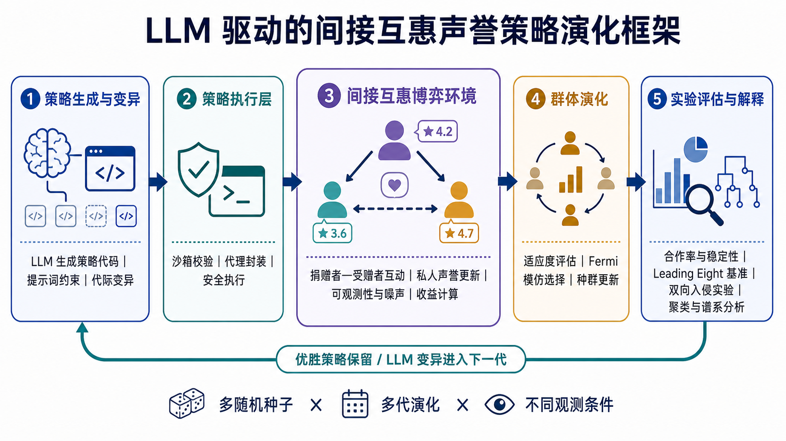

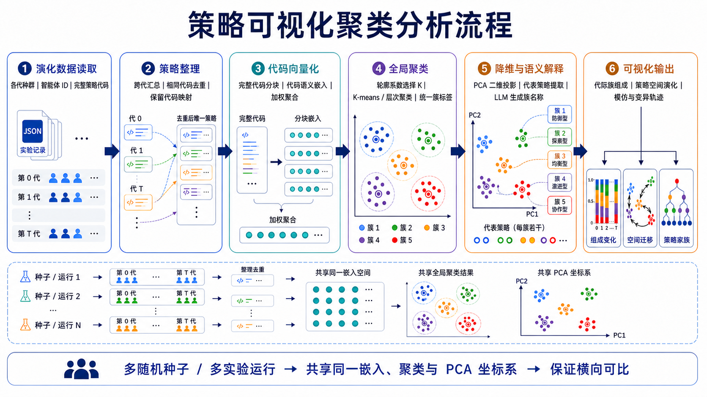

## Demo

### PCA strategy-space evolution

| `agent-type1` | `agent-type2` |
| --- | --- |
| 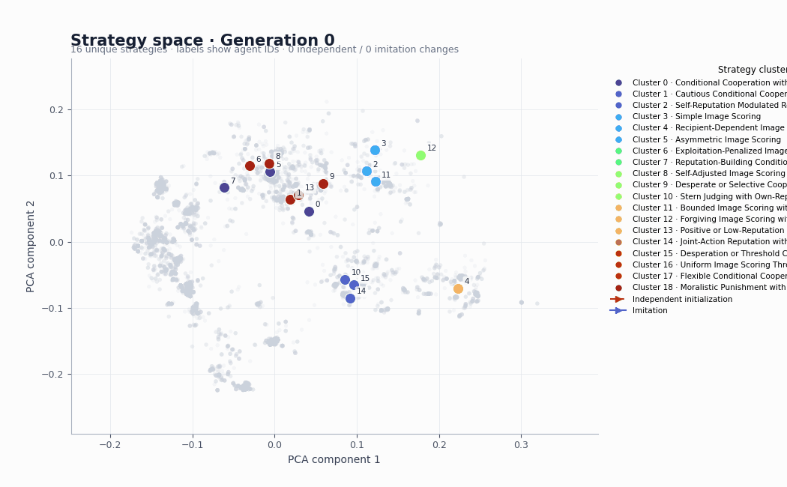 |  |

For `agent-type1`, a single embedding, K-means model, and PCA projection are fit
jointly on every strategy from seeds 0–5. Only seed 4 is rendered because it has
the highest final cooperation rate (`1.000`) among the six runs. Its animation
therefore moves inside the common six-seed coordinate system, and its colors
use the common `K=19` cluster labels. The `agent-type2` panel continues to show
its seed-0 analysis.

A compact research showcase of how LLM-evolved strategies behave in reputation-driven cooperation games.

The core result is that cooperation can emerge from LLM-generated strategies, but the outcome is strongly seed-dependent and sensitive to the implementation details of the reputation logic. Classical indirect-reciprocity norms remain more stable, while learned strategies are promising but less robust.

### 1) Cooperation evolution: agent-type1 vs. agent-type2

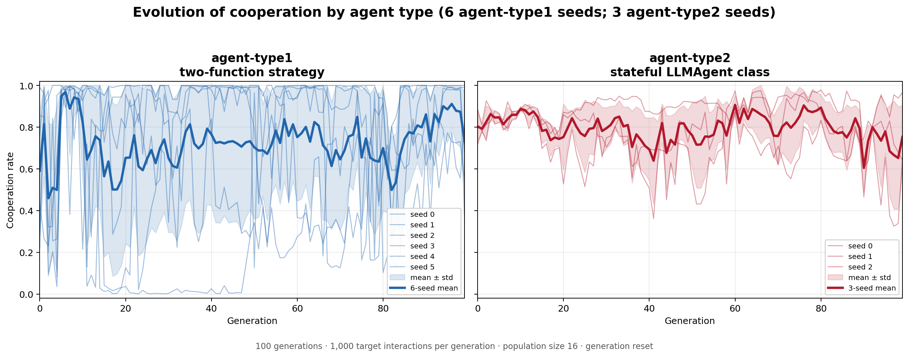

The figure uses all six updated `agent-type1` runs (seeds 0–5) and the three
available `agent-type2` runs (seeds 0–2). Both panels use 100 generations,
1,000 target interactions per generation, a population of 16, and
generation-level state reset. Thin lines show individual seeds, thick lines
show the mean for each agent type, and shaded bands show one standard
deviation. The updated `agent-type1` prompt and interface can produce high
cooperation, but its runs remain substantially more variable than the three
`agent-type2` runs.

### 2) Observability sweep: observation probability x agent type

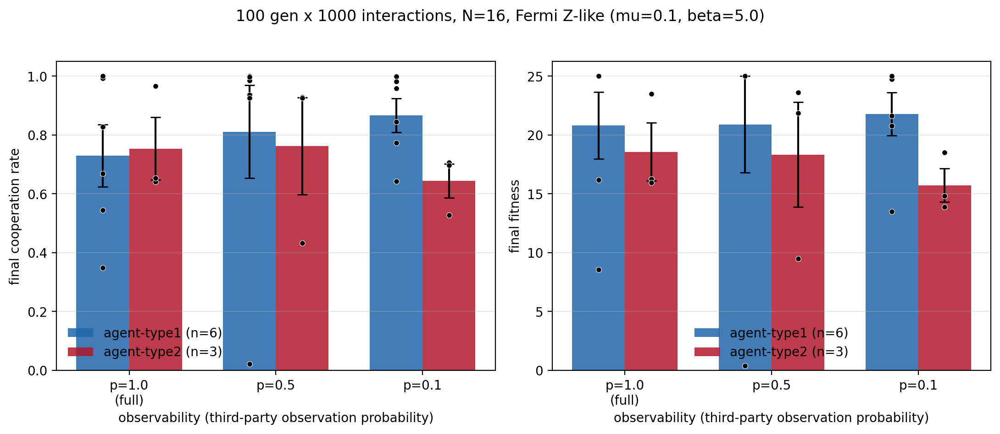

Third-party observation was made probabilistic: with probability *p* each
non-player agent observes a joint action (self-judgments always happen; `p=1.0`
is the original full-observability setting). Both agent types were re-run at
`p = 0.5` and `p = 0.1` under otherwise identical settings (100 generations,
1,000 interactions/gen, N=16, Fermi Z-like). Final-generation cooperation rate
and fitness, mean ± SE:

| agent-type | p | n | coop mean ± SE | fitness mean ± SE |
| --- | ---: | ---: | ---: | ---: |
| `agent-type1` | 1.0 | 6 | 0.730 ± 0.106 | 20.79 ± 2.84 |
| `agent-type1` | 0.5 | 6 | 0.811 ± 0.158 | 20.90 ± 4.10 |
| `agent-type1` | 0.1 | 6 | 0.866 ± 0.057 | 21.77 ± 1.82 |
| `agent-type2` | 1.0 | 3 | 0.753 ± 0.106 | 18.56 ± 2.47 |
| `agent-type2` | 0.5 | 3 | 0.762 ± 0.165 | 18.33 ± 4.45 |
| `agent-type2` | 0.1 | 3 | 0.644 ± 0.058 | 15.73 ± 1.41 |

Directionally, lower observability raises final cooperation for `agent-type1`
(0.730 → 0.866; Cohen's *d* = -0.66 for p=1.0 vs p=0.1) and lowers it for
`agent-type2` (0.753 → 0.644; *d* = +0.74). At `p=0.1` the two agent types
separate clearly (cooperation *d* = +1.71, Mann-Whitney *p* = 0.053; fitness
*d* = +1.52, *p* = 0.092). None of the within-type pairwise Mann-Whitney tests
reaches significance (*p* > 0.18), so with 3–6 seeds per cell these are
*exploratory* trends, not confirmatory effects. `agent-type2`'s class-based
mutations also broke more often at low observability (syntax/missing-method
failures), inflating wall-clock time ~4x per seed.

### 3) agent-type1 vs. agent-type2: different strategy interfaces

The two agent types solve the same reputation game but expose different strategy
interfaces to the LLM:

| Agent type | Generated strategy | State and memory | Search space |
| --- | --- | --- | --- |
| `agent-type1` | Two functions: `observe(...)` and `decide(...)` | Updates donor and recipient reputations through a fixed functional interface | Narrower and more explicitly guided |
| `agent-type2` | A complete `LLMAgent` class with `__init__`, `decide()`, and `observe(...)` | May maintain internal state and update it after interactions | Richer and less constrained |

This distinction matters when reading the results: differences between the two
agent types reflect a change in the representation available to evolution, not
just a new experiment revision. The corrected `agent-type2` dynamics are not
uniformly better across seeds. Some seeds improve sharply, while others enter a
low-cooperation basin, producing a more bimodal evolutionary landscape.

### 4) Compared against the leading-eight norms

The canonical leading-eight strategies stay near cooperation rate 1.0 across the full horizon. The LLM trajectories are less reliable and more variable, which makes the empirical message precise: learned systems can discover effective cooperation, but they do not yet match the robustness of classical indirect-reciprocity norms.

### 5) Population structure in embedding space

| `agent-type1` | `agent-type2` |
| --- | --- |
| 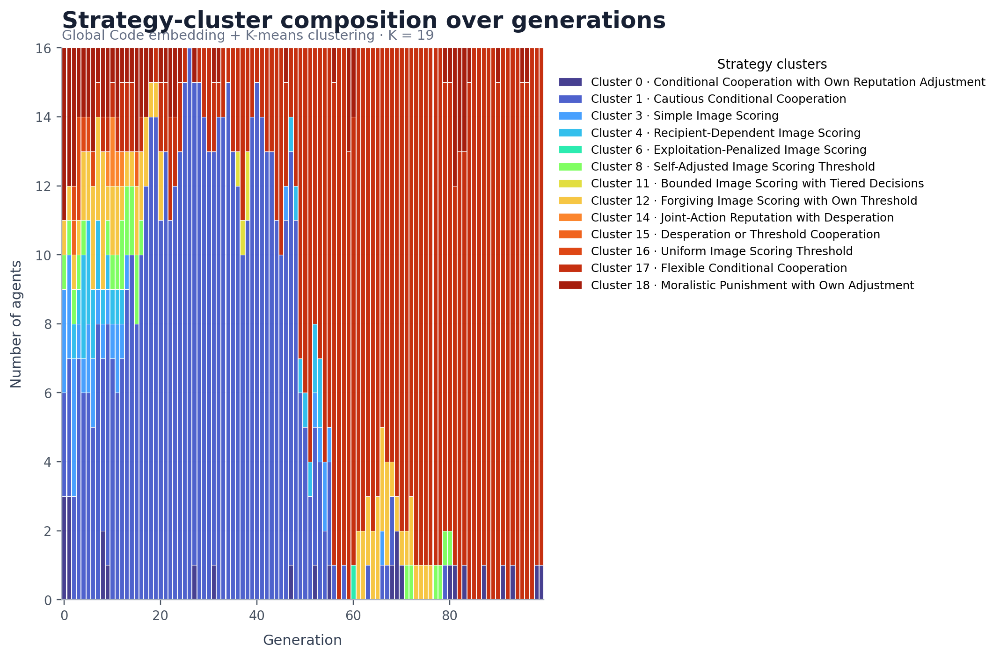 | 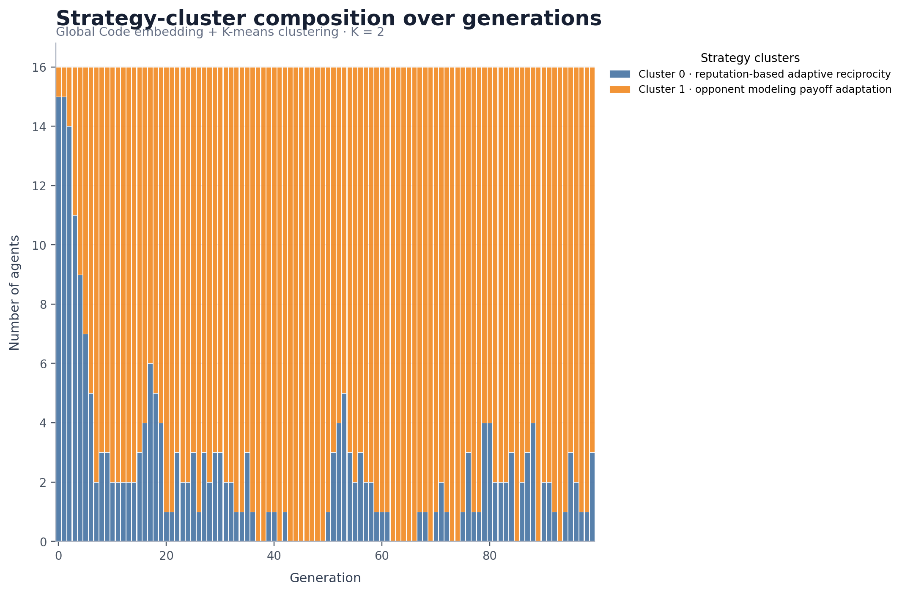 |

The `agent-type1` panel shows seed 4 using labels learned jointly from all six
agent-type1 runs; it is not a seed-4-only clustering. The `agent-type2` panel
shows seed 0 in its own shared analysis. The agent-type1 population moves among
a larger set of strategy families, whereas agent-type2 rapidly becomes
dominated by one of two broad families.

This is the core story of the project: the environment supports cooperation, the LLM can discover cooperative policies, the corrected implementation changes the attractor structure, and the classical norms remain the reliability benchmark.

### 6) Final-survivor ancestry: agent-type1 vs. agent-type2

| `agent-type1` | `agent-type2` |
| --- | --- |
| 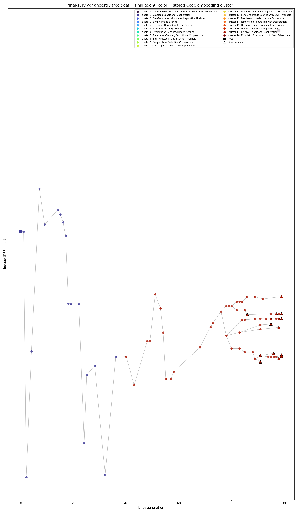 | 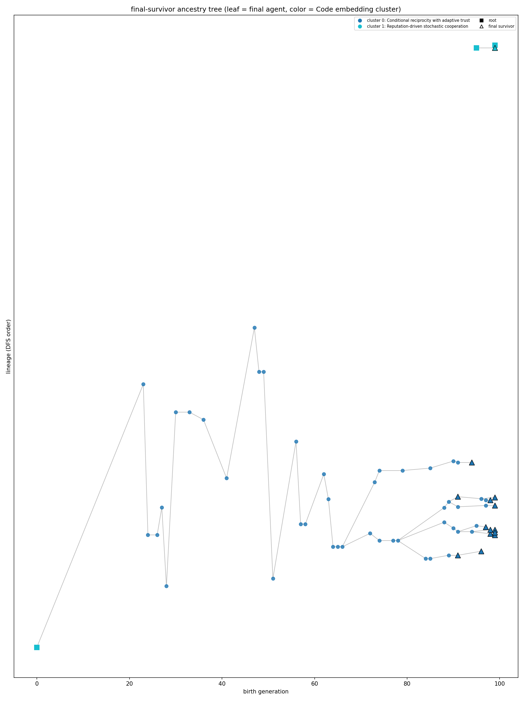 |

The agent-type1 tree is the highest-final-cooperation run (seed 4), colored by
the six-seed joint clusters; the agent-type2 tree remains seed 0. Both show only
ancestry paths leading to final survivors. Squares mark roots and triangles
mark final survivors.

### 7) Lineage survival intervals

| `agent-type1` | `agent-type2` |
| --- | --- |
| 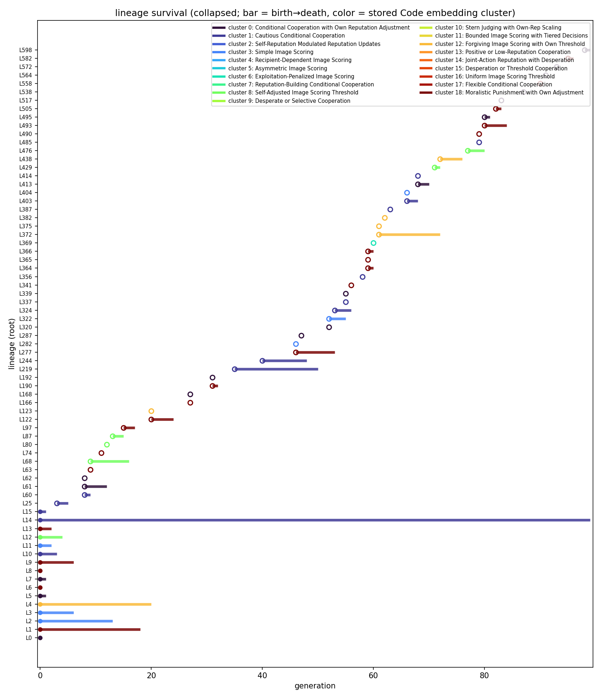 | 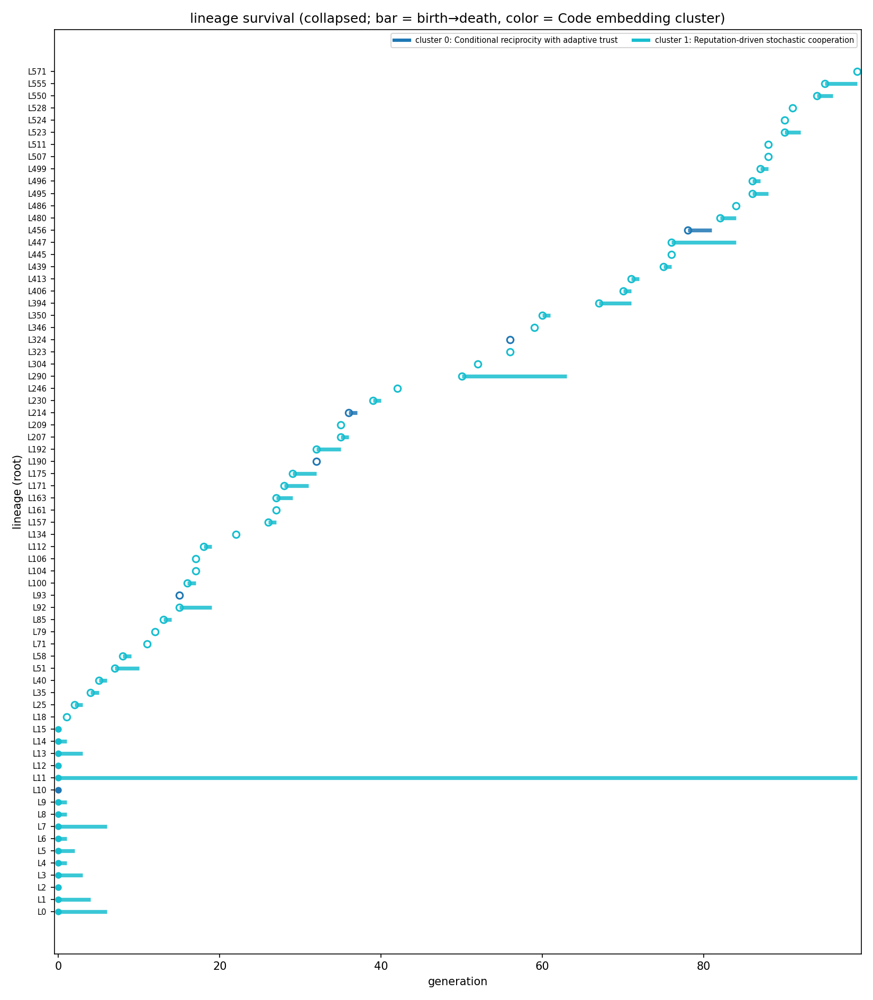 |

Each horizontal interval runs from a collapsed lineage's birth to its last
appearance. Agent-type1 uses the common six-seed analysis (`K=19`) and displays
seed 4; agent-type2 uses its seed-0 analysis (`K=2`).

### 8) Representative final survivor from each dominant lineage family

This section documents the representatives used by the bidirectional invasion
experiment: seed 4 for `agent-type1` and seed 0 for `agent-type2`, matching the
representative runs used by the visual analyses above.

The selection rule is identical for both runs: group final agents by root
lineage, choose the root family with the most final members, then choose the
highest-fitness member of that family (breaking ties by agent ID).

| Agent type | Dominant root lineage | Final members | Representative | Fitness | Behavioral summary |
| --- | ---: | ---: | ---: | ---: | --- |
| `agent-type1` | 14 | 15/16 | agent 0 | 25.0 | Uses context-sensitive bounded reputation updates and cooperates with neutral-to-good opponents |
| `agent-type2` | 11 | 13/16 | agent 1 | 26.0 | Maintains opponent histories, estimates conditional cooperation, and adapts trust, generosity, exploration, and risk tolerance |

#### agent-type1 representative (complete strategy)

Source: agent 0 in the
[`agent-type1` seed-4 evolution record](results/quantitative_baseline/LLM_agent-type1_fermi_z_v3_g100_1000inter_N16_genreset_seed4/evolutionary.json).

```python
def observe(
    donor_reputation: float,
    donor_action: str,
    recipient_reputation: float,
    recipient_action: str,
    my_reputation: float,
) -> tuple[float, float]:
    if donor_action == "cooperate":
        weight = 0.4 if recipient_reputation >= 0 else 0.2
        donor_new = donor_reputation + weight * (1 - abs(donor_reputation))
        if recipient_action == "defect":
            donor_new -= 0.3
    else:
        donor_new = donor_reputation - 0.5 if recipient_reputation >= 0 else donor_reputation + 0.3 * (1 - abs(donor_reputation))
        if recipient_action == "cooperate":
            donor_new -= 0.4

    if recipient_action == "cooperate":
        weight = 0.4 if donor_reputation >= 0 else 0.2
        recipient_new = recipient_reputation + weight * (1 - abs(recipient_reputation))
        if donor_action == "defect":
            recipient_new -= 0.3
    else:
        recipient_new = recipient_reputation - 0.5 if donor_reputation >= 0 else recipient_reputation + 0.3 * (1 - abs(recipient_reputation))
        if donor_action == "cooperate":
            recipient_new -= 0.4

    return (
        max(-1.0, min(1.0, donor_new)),
        max(-1.0, min(1.0, recipient_new)),
    )

def decide(my_reputation: float, opponent_reputation: float) -> bool:
    if opponent_reputation >= 0.3 and my_reputation > -0.35:
        return True
    if opponent_reputation < -0.2:
        return False
    return opponent_reputation > -0.1
```

#### agent-type2 representative (decision core)

The complete evolved class is stored as agent 1 in the
[`agent-type2` seed-0 evolution record](results/quantitative_baseline/LLM_v3_fermi_z_v3_g100_1000inter_N16_genreset_seed0/evolutionary.json).
Its `observe(...)` method maintains the histories and adaptive statistics
consumed by the following abridged decision core:

```python
def decide(self) -> bool:
    # Abridged for readability; see the linked evolution record for exact code.
    opponent = self._ctx_opponent_id
    if opponent is None:
        return random.random() < 0.5

    history = self.opponent_history.get(opponent, [])
    if history:
        observed_cooperation = sum(a == "cooperate" for a in history) / len(history)
        self.trust = 0.7 * observed_cooperation + 0.3 * self.reputation
    else:
        self.trust = self.reputation

    threshold = (
        0.5 - self.generosity
        + self.round_num * 0.001
        + self.strategy_adjustment
    )
    if random.random() < self.exploration_rate:
        return random.random() < 0.5
    if self.trust > threshold:
        return True
    return random.random() < 0.2 * self.risk_tolerance
```

The contrast is structural as well as behavioral: the updated `agent-type1`
expresses observation and action as two stateless functions, while
`agent-type2` combines opponent modeling with persistent state and online
adaptation.

### 9) Best evolved strategies vs. the Leading Eight: bidirectional invasion

We tested the two representative strategies selected above against all eight
canonical norms (`IS`, `SS`, `SJ`, `SC`, `SH`, `IS+`, `SS+`, and `SJ+`). The
experiment uses the project's existing agent executors and private-reputation
game logic rather than a separate game implementation. Selection is
deterministic payoff imitation: a sampled learner always copies a sampled role
model with strictly higher fitness and never copies one with equal or lower
fitness; no Fermi/logistic acceptance probability is used.

For each agent type and norm, the experiment starts with one invader in a
population of 15 and tests both directions. Bar length is the number of
fixations across seeds `0`, `1`, and `2`; leftward bars show a Leading Eight
norm invading the evolved strategy, and rightward bars show the evolved
strategy invading the norm.

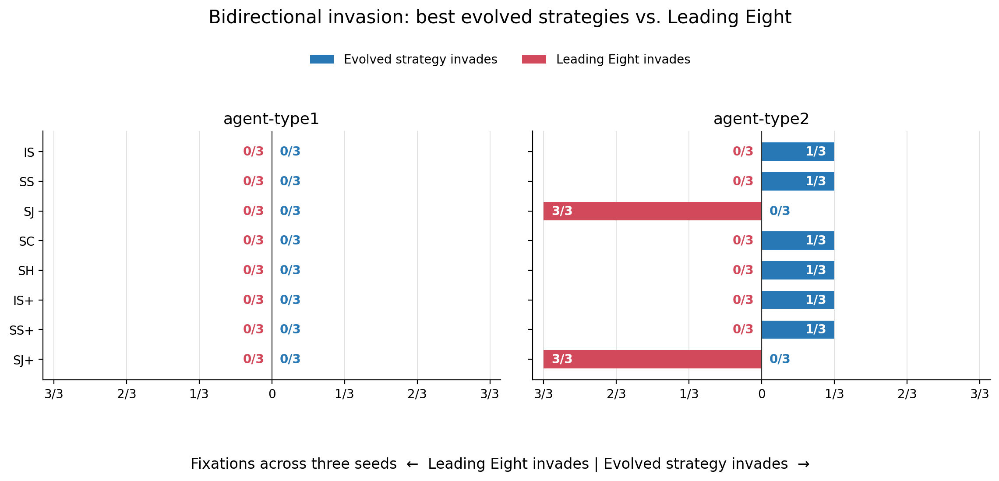

The formal batch contains 96 runs: two agent types, eight norms, two invasion
directions, and three seeds. Every run uses 50 generations, 1,000 interactions
per generation, an 800-interaction burn-in, a 200-interaction fitness window,
`b=2`, `c=1`, full observation, observer-private reputations, and 15 sampled
imitation opportunities per generation. As in the population module, every slot is
re-instantiated after selection: its stable ID and selected strategy type are
preserved, while private reputations and strategy-internal state reset.

The updated result is asymmetric for `agent-type2`: it fixed in `1/3` runs
against `IS`, `SS`, `SC`, `SH`, `IS+`, and `SS+`, while those six norms had
`0/3` reverse-direction fixations. `SJ` and `SJ+` show the opposite pattern:
each fixed in `3/3` runs against `agent-type2`, while the evolved strategy had
`0/3` outward fixations. For the seed-4 `agent-type1` representative, every
norm and both directions produced `0/3` fixations; all single invaders became
extinct in this three-seed batch.
Because each cell contains only three seeds, these fractions are descriptive
results rather than precise estimates of fixation probability.

Run or resume this single-invader batch with:

```powershell
uv run run-best-leading-eight-invasion --invader-counts 1 --workers 8
```

The runner also supports an initial-frequency sweep with `n=1..14`. Formal
outputs remain available for reproducibility. Regenerate the README figure with
`uv run plot-best-leading-eight-invasion`; the experiment runner is
`experiments.analysis.invasion.run_best_leading_eight_invasion`.

### 10) N=100 invasion ability across initial invader counts

The single-invader result does not show whether a strategy needs a critical
mass before it can spread. We therefore ran a separate bidirectional experiment
in a population of 100, starting with `1, 5, 10, 20, 30, 40, 50, 60, 70, 80,
90, 95, 99` invaders. The full design contains 1,248 runs: two agent types,
eight Leading Eight norms, two directions, 13 initial counts, and three seeds.
Each run retains the 50-generation, 1,000-interaction, `800/200` burn-in and
fitness-window design. There are 100 deterministic payoff-imitation
opportunities per generation, and absorbing fixation/extinction states stop
early because mutation is disabled.

The dashed diagonal in each panel is the no-frequency-change reference
(`final share = initial share`). Curves above it indicate expansion; curves
below it indicate contraction.

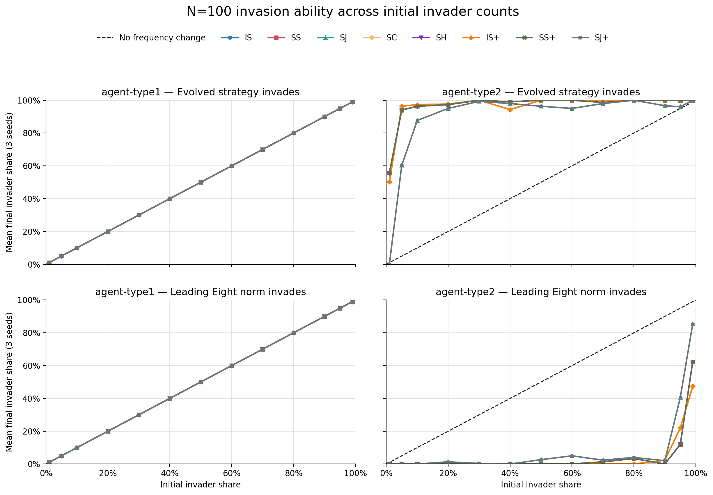

The seed-4 `agent-type1` curves coincide with the diagonal for every tested
norm and both directions: after 50 generations the mean final share equals the
initial share. Under strict higher-payoff imitation, neither side gains a
systematic payoff advantage that changes its frequency. Increasing the initial
number therefore does not reveal a hidden invasion threshold for this strategy.

The `agent-type2` result is strongly asymmetric. Against `IS`, `SC`, and `IS+`,
a 1% evolved-strategy minority reaches a mean final share of 50%; against `SS`,
`SH`, and `SS+`, it reaches 56%. Starting from 5%, these six comparisons end at
94–96% on average. `SJ` and `SJ+` are harder at very low frequency: a 1%
minority becomes extinct, but 5%, 10%, and 20% minorities reach approximately
60%, 88%, and 95%, respectively, and a 30% minority reaches 99%.

In the reverse direction, no Leading Eight norm expands on average from any
tested initial share. Up to a 90% initial majority, the norms generally collapse
to 0–5% against `agent-type2`. Even from 99%, the six non-SJ norms finish at
47–62% on average, while `SJ` and `SJ+` finish at 85%. Thus invasion count
changes the low-frequency outcome for `SJ`/`SJ+`, but the N=100 sweep still
shows a broad frequency-selection advantage for `agent-type2` under this
deterministic payoff-imitation rule.

Run or resume the experiment and regenerate the figure with:

```powershell
uv run run-n100-invasion-count-sweep --workers 12
uv run plot-n100-invasion-count-sweep
```

### 11) N=100 invasion with action and observation errors

The diagonal `agent-type1` baseline above can arise when reputations converge to
an all-good state and the strategies consequently produce nearly identical
behavior. To perturb that state, we repeated the complete 1,248-run N=100 sweep
with a 1% action-error probability and a 1% observation-error probability. An
action error flips a strategy's intended action before payoffs are calculated.
An observation error independently flips each executed action as seen by each
observer before that observer updates its private reputations. Thus payoffs use
executed actions, while reputation updates use observer-specific perceptions.

All other settings are unchanged: 50 generations, 1,000 interactions per
generation, the final 200 interactions for fitness, 100 imitation opportunities
per generation, three seeds, no mutation, and population-aligned resetting of
agents, private reputations, and internal state between generations. Selection
still uses deterministic payoff imitation—when the sampled model has strictly
higher fitness, the learner copies it; no Fermi parameter is used.

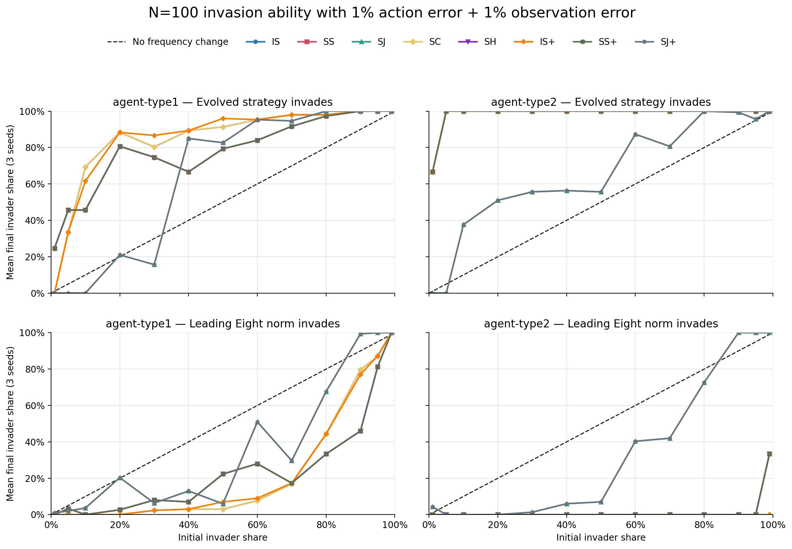

The perturbation breaks the previous neutrality of `agent-type1`. From a 5%
minority it reaches about 33% against `IS`, `SC`, and `IS+`, and about 46%
against `SS`, `SH`, and `SS+`. A single `agent-type1` invader remains vulnerable
to stochastic loss: it becomes extinct against the first group in these three
seeds, while its mean final share is about 25% against the second group.
`SJ` and `SJ+` remain the clearest low-frequency barrier: `agent-type1` becomes
extinct from 1%, 5%, and 10%, but grows to about 83% when starting from 50%.
In the reverse direction, Leading Eight minorities generally contract, although
`SJ`/`SJ+` can recover when they already begin near dominance. The noisy result
therefore rejects the earlier interpretation of universal two-way neutrality:
the all-good steady state had hidden selection differences, but
`agent-type1`'s advantage is norm- and frequency-dependent.

`agent-type2` remains substantially stronger. A single evolved invader reaches
about 67% against the six non-`SJ` norms, and a 5% minority fixes in all three
seeds. Against `SJ`/`SJ+`, 1% and 5% minorities become extinct, a 10% minority
reaches about 38%, and a 50% start reaches about 56%. In the reverse direction,
the six non-`SJ` norms normally become extinct even from very high initial
shares; `SJ`/`SJ+` still expand when they start at 90% or more. Consequently,
the errors reveal an even clearer broad invasion and resistance advantage for
`agent-type2`, while preserving a frequency-dependent exception for
`SJ`/`SJ+`.

Run or resume the noisy sweep and regenerate its figure with:

```powershell
uv run run-n100-invasion-count-sweep --workers 12 --action-error 0.01 --observation-error 0.01
uv run plot-n100-invasion-count-sweep --summary results/quantitative_baseline/invasion/n100_noisy_invasion_count_sweep/summary.json --output README.assets/n100_noisy_invasion_count_sweep.png
```

---

## Project overview

This repository contains the experimental code and paper artifacts for
studying cooperation in LLM-coded populations with private reputation stores,
quantitative assessment, and controlled observability.

## Requirements

- Python 3.12 or newer
- [`uv`](https://docs.astral.sh/uv/)
- A DeepSeek API key for LLM-generating experiments

The API configuration is loaded from a root-level `.env` file. Start from
`.env.example` and keep `.env` local; it is ignored by Git.

## Install

From the repository root:

```powershell
uv sync
```

The project dependencies and executable entry points are defined in
`pyproject.toml`, with versions locked in `uv.lock`.

## Project layout

```text
.
├── experiments/
│   ├── agents/              # Agent interfaces and LLM prompts
│   ├── analysis/            # Analysis and visualization modules
│   ├── config/              # YAML settings and environment loading
│   ├── evolution/           # Evolutionary population code
│   ├── game/                # Quantitative reputation games
│   ├── sandbox/             # Strategy validation and execution
│   ├── tools/               # Re-run orchestration
│   ├── run_fermi_v3.py      # Legacy-named CLI for agent-type2 evolution
│   └── v2_quantitative/     # Quantitative-assessment engine
├── results/                 # Experiment outputs and figures
├── PAPER_DRAFT.md
├── pyproject.toml
└── uv.lock
```

The Agent 2 invasion runner and dashboard are maintained under
`experiments.analysis.invasion` and `experiments.analysis`, respectively.
Analysis commands resolve project-relative result directories at runtime;
paths can be overridden with explicit CLI options.

The matched `agent-type1` versus `agent-type2` evolution plot is provided by
`experiments.analysis.plot_evolution_curves` and writes PNG/PDF figures under
`results/quantitative_baseline/plots/` by default. To refresh the figure used
at the top of this README, run:

```powershell
uv run plot-evolution-curves --output README.assets/g100_3seed_1000inter.png --no-pdf
```

## Common commands

The configured project scripts can be run with `uv run`:

```powershell
# Main legacy donor-game CLI
uv run llm-reputation --help

# Audit or re-run the documented experiment batches
uv run rerun-experiments --audit
uv run rerun-experiments --experiments 2 --seeds 0 1 2

# Agent 2 invasion experiment (336 fixed-strategy runs by default)
uv run run-agent2-invasion --help

# Best agent-type1 and agent-type2 representatives vs. all Leading Eight norms
uv run run-best-leading-eight-invasion --invader-counts 1 --workers 8
uv run plot-best-leading-eight-invasion

# N=100 bidirectional sweep over initial invader counts
uv run run-n100-invasion-count-sweep --workers 12
uv run plot-n100-invasion-count-sweep

# N=100 sweep with independent 1% action and observation errors
uv run run-n100-invasion-count-sweep --workers 12 --action-error 0.01 --observation-error 0.01
uv run plot-n100-invasion-count-sweep --summary results/quantitative_baseline/invasion/n100_noisy_invasion_count_sweep/summary.json --output README.assets/n100_noisy_invasion_count_sweep.png

# Generate the invasion dashboard
uv run plot-agent2-invasion

# Plot cooperation evolution curves
uv run plot-evolution-curves

# Generate legacy paper figures and summary tables
uv run make-figures --help

# Plot lineage survival and final-survivor trees
uv run plot-lineage --help

# agent-type2 Fermi-style LLM evolution experiment (legacy module name; see below)
uv run python -m experiments.run_fermi_v3 --help
```

The same commands are available through module execution, for example:

```powershell
uv run python -m experiments.analysis.plot_agent2_schmid_invasion
uv run python -m experiments.analysis.plot_evolution_curves
uv run python -m experiments.analysis.make_figures --help
uv run python -m experiments.analysis.plot_lineage --help
uv run python -m experiments.run_fermi_v3 --dry-run --seed 0
```

`uv run` requires a command or module; there is no single implicit default
task for this project.

## Historical Agent 2 / Schmid L1-L2-L7-L8 invasion experiment

The current invasion study uses the evolved `agent_id=2` strategy from
generation 99 of the seed-2 production run against the four norms identified
by Schmid et al. (2023) as robust under quantitative assessment with private
and noisy information: `L1`, `L2`, `L7`, and `L8`.

The runner uses:

- `N=15`, 50 generations, and seeds `0, 1, 2`;
- exactly 1,000 pair interactions per generation;
- the first 800 interactions as burn-in;
- the final 200 interactions for selection fitness;
- benefit `b=2`, cost `c=1`, full observation, and observer-private reputations;
- synchronous fixed-strategy Fermi imitation with `beta=5` and 15 updates per generation;
- both directions: Agent 2 invading a norm and a norm invading Agent 2;
- initial invader counts `n=1..14`.

Run or resume the experiment with:

```powershell
uv run run-agent2-invasion
```

Completed JSON files are cached, so re-running resumes without repeating
finished cells. Use `--smoke` for a small validation run, or `--help` for
selection of norms, directions, seeds, and output paths.

Results are written under:

```text
results/quantitative_baseline/invasion/
└── agent2_schmid_L1_L2_L7_L8_mainmatched/
    ├── summary.json
    ├── agent2_schmid_bidirectional_invasion_dashboard.png
    ├── agent2_invades_norm/<norm>/n<k>_seed<s>/invasion.json
    └── norm_invades_agent2/<norm>/n<k>_seed<s>/invasion.json
```

Generate the dashboard again with:

```powershell
uv run plot-agent2-invasion

# Equivalent module form:
uv run python -m experiments.analysis.invasion.run_agent2_schmid_invasion --help
```

The plotting module validates that all 336 formal result files exist, that
every trajectory uses the `1000/800/200` interaction split, and that the four
norms have matching population-frequency trajectories before producing the
figure.

## agent-type2 Fermi-style LLM evolution experiment

The entry point `experiments/run_fermi_v3.py` uses a legacy filename and is a
command-line launcher for the `agent-type2` (full `LLMAgent` class) population evolution with the Fermi imitation
selection scheme. It is a thin CLI wrapper over
`experiments.v2_quantitative.population.V2EvolutionaryPopulation` and mirrors
the production-run script `_run_fermi_3seed_100gen_v3.py` at the repo root.

Run a single seed:

```powershell
uv run python -m experiments.run_fermi_v3 --seed 0 --gens 100 --target-interactions 1000
```

Run multiple seeds sequentially (default is seeds `0 1 2`):

```powershell
uv run python -m experiments.run_fermi_v3 --seeds 0 1 2
```

Preview the run plan without touching the API:

```powershell
uv run python -m experiments.run_fermi_v3 --dry-run --seeds 0 1 2
```

Common options:

| Option | Default | Description |
| --- | --- | --- |
| `--seed N` / `--seeds N...` | `[0, 1, 2]` | Seed(s) to run; `--seed` overrides `--seeds` |
| `--gens N` | `100` | Number of generations |
| `--target-interactions N` | `1000` | Target PD interactions per generation |
| `--population-size N` | `15` | Population size |
| `--updates-per-gen N` | `15` | Fermi imitation updates per generation |
| `--fermi-beta F` | `5.0` | Fermi selection strength |
| `--mutation-rate F` | `0.1` | Probability of an independent LLM rewrite after accepted imitation (`mu`); the `1-mu` branch is parent-conditioned learning |
| `--mutation-temperature F` | `0.8` | LLM mutation temperature |
| `--imitation-learning {random,deliberate}` | `random` | Parent-conditioned child generation: an undirected related variation or an explicit attempt to improve using the parent's real fitness |
| `--benefit F` / `--cost F` | `2.0` / `1.0` | PD payoffs |
| `--observability S` | `full` | Observability mode |
| `--provider S` | `deepseek` | API provider for key/base-url lookup |
| `--model S` | provider default | LLM model name |
| `--llm-thinking` | off | Enable LLM thinking mode |
| `--agent-type {v2,v3}` | `v3` | Legacy CLI values: `v2` selects `agent-type1`; `v3` selects `agent-type2` |
| `--label S` | mode-specific | Output directory / summary label; the automatic label contains `learn-random` or `learn-deliberate` |
| `--output-root PATH` | `results/quantitative_baseline` | Root for per-seed result folders |
| `--dry-run` | off | Validate and print the seed plan without running |

Per seed, results are written to
`<output-root>/<label>_seed<s>/evolutionary.json`, and a combined
`<label>_summary.json` is written after each seed completes. The launcher reads
API keys from `.env` via `experiments.config.load_env` and exits non-zero if a
seed fails.

## Re-running the original experiment batches

The orchestration tool documents the earlier donor-game and IPD comparison
experiments:

```powershell
uv run rerun-experiments --audit
uv run rerun-experiments --experiments 1 --seeds 0 1 2
uv run rerun-experiments --experiments 2 --seeds 0 1 2
uv run rerun-experiments --experiments 3 --seeds 0 1 2
uv run rerun-experiments --experiments 4 --seeds 0 1 2
uv run rerun-experiments --experiments 5 --seeds 0 1 2
```

See [`experiments/tools/README.md`](experiments/tools/README.md) for the
full batch plan and trial-specific options.

## Key references

- Schmid, L., Ekbatani, F., Hilbe, C. & Chatterjee, K. (2023).
  *Quantitative assessment can stabilize indirect reciprocity under imperfect
  information.* Nature Communications 14, 2086.
- Ohtsuki, H. & Iwasa, Y. (2006).
  *The leading eight: Social norms that can maintain cooperation by indirect
  reciprocity.* Journal of Theoretical Biology 239, 435–444.
- Willis, R., Du, Y., Leibo, J. Z. & Luck, M. (2025).
  *Will Systems of LLM Agents Cooperate: An Investigation into a Social
  Dilemma.* arXiv:2501.16173.

## Repository status

- Core experiment and re-run tooling are implemented.
- The Agent 2 / Schmid L1–L2–L7–L8 bidirectional invasion runner is implemented
  and has completed 336 runs.
- The package exposes `uv run` entry points for the main CLI, re-run tool,
  invasion runner, and invasion dashboard.
- Paper drafts and supplementary artifacts remain under active development.

---

