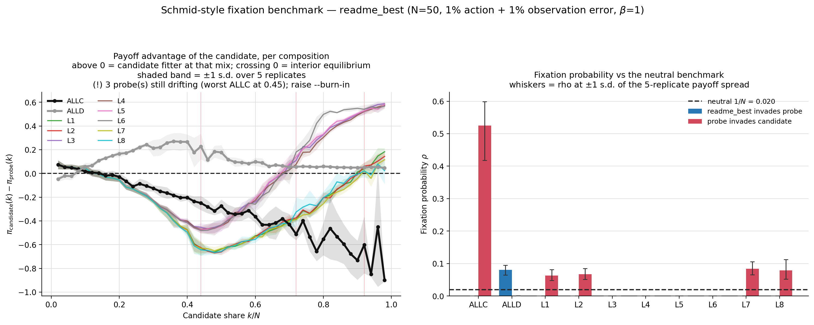
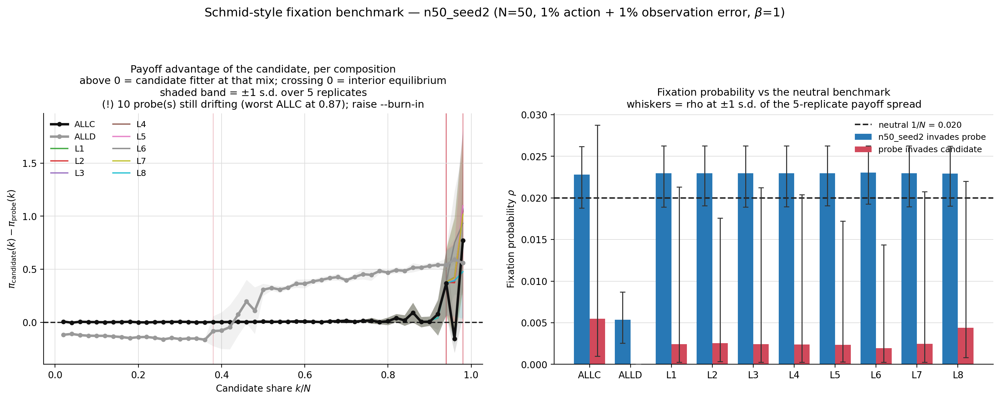

# LLM-Driven Evolution of Reputation Algorithms

Private dataclass signals are available as the opt-in `agent-type2-signal`
variant. See [the interface and running instructions](docs/private_signal_agents.md).
The existing agent-type1 and agent-type2 experiments keep their original interfaces.


## Demo

### PCA strategy-space evolution

| `agent-type1` | `agent-type2` |
| --- | --- |
|  |  |

For `agent-type1`, a single embedding, K-means model, and PCA projection are fit
jointly on every strategy from seeds 0–5. Only seed 4 is rendered because it has
the highest final cooperation rate (`1.000`) among the six runs. Its animation
therefore moves inside the common six-seed coordinate system, and its colors
use the common `K=19` cluster labels. The `agent-type2` panel continues to show
its seed-0 analysis.

A compact research showcase of how LLM-evolved strategies behave in reputation-driven cooperation games.

The core result is that cooperation can emerge from LLM-generated strategies, but the outcome is strongly seed-dependent and sensitive to the implementation details of the reputation logic. Classical indirect-reciprocity norms remain more stable, while learned strategies are promising but less robust.

### 1) Cooperation evolution: agent-type1 vs. agent-type2


The figure uses all six updated `agent-type1` runs (seeds 0–5) and the three
available `agent-type2` runs (seeds 0–2). Both panels use 100 generations,
1,000 target interactions per generation, a population of 16, and
generation-level state reset. Thin lines show individual seeds, thick lines
show the mean for each agent type, and shaded bands show one standard
deviation. The updated `agent-type1` prompt and interface can produce high
cooperation, but its runs remain substantially more variable than the three
`agent-type2` runs.

### 2) Observability sweep: observation probability x agent type


Third-party observation was made probabilistic: with probability *p* each
non-player agent observes a joint action (self-judgments always happen; `p=1.0`
is the original full-observability setting). Both agent types were re-run at
`p = 0.5` and `p = 0.1` under otherwise identical settings (100 generations,
1,000 interactions/gen, N=16, Fermi Z-like). Final-generation cooperation rate
and fitness, mean ± SE:

| agent-type | p | n | coop mean ± SE | fitness mean ± SE |
| --- | ---: | ---: | ---: | ---: |
| `agent-type1` | 1.0 | 6 | 0.730 ± 0.106 | 20.79 ± 2.84 |
| `agent-type1` | 0.5 | 6 | 0.811 ± 0.158 | 20.90 ± 4.10 |
| `agent-type1` | 0.1 | 6 | 0.866 ± 0.057 | 21.77 ± 1.82 |
| `agent-type2` | 1.0 | 3 | 0.753 ± 0.106 | 18.56 ± 2.47 |
| `agent-type2` | 0.5 | 3 | 0.762 ± 0.165 | 18.33 ± 4.45 |
| `agent-type2` | 0.1 | 3 | 0.644 ± 0.058 | 15.73 ± 1.41 |

Directionally, lower observability raises final cooperation for `agent-type1`
(0.730 → 0.866; Cohen's *d* = -0.66 for p=1.0 vs p=0.1) and lowers it for
`agent-type2` (0.753 → 0.644; *d* = +0.74). At `p=0.1` the two agent types
separate clearly (cooperation *d* = +1.71, Mann-Whitney *p* = 0.053; fitness
*d* = +1.52, *p* = 0.092). None of the within-type pairwise Mann-Whitney tests
reaches significance (*p* > 0.18), so with 3–6 seeds per cell these are
*exploratory* trends, not confirmatory effects. `agent-type2`'s class-based
mutations also broke more often at low observability (syntax/missing-method
failures), inflating wall-clock time ~4x per seed.

### 3) agent-type1 vs. agent-type2: different strategy interfaces

The two agent types solve the same reputation game but expose different strategy
interfaces to the LLM:

| Agent type | Generated strategy | State and memory | Search space |
| --- | --- | --- | --- |
| `agent-type1` | Two functions: `observe(...)` and `decide(...)` | `observe` is ONE-DIRECTIONAL: it judges a single target player and returns that player's new reputation; the framework calls it twice per joint action (roles swapped) to update both players | Narrower and more explicitly guided |
| `agent-type2` | A complete `LLMAgent` class with `__init__`, `decide()`, and `observe(...)` | May maintain internal state and update it after interactions | Richer and less constrained |

This distinction matters when reading the results: differences between the two
agent types reflect a change in the representation available to evolution, not
just a new experiment revision. The corrected `agent-type2` dynamics are not
uniformly better across seeds. Some seeds improve sharply, while others enter a
low-cooperation basin, producing a more bimodal evolutionary landscape.

### 4) Compared against the leading-eight norms

The canonical leading-eight strategies stay near cooperation rate 1.0 across the full horizon. The LLM trajectories are less reliable and more variable, which makes the empirical message precise: learned systems can discover effective cooperation, but they do not yet match the robustness of classical indirect-reciprocity norms.

### 5) Population structure in embedding space

| `agent-type1` | `agent-type2` |
| --- | --- |
|  |  |

The `agent-type1` panel shows seed 4 using labels learned jointly from all six
agent-type1 runs; it is not a seed-4-only clustering. The `agent-type2` panel
shows seed 0 in its own shared analysis. The agent-type1 population moves among
a larger set of strategy families, whereas agent-type2 rapidly becomes
dominated by one of two broad families.

This is the core story of the project: the environment supports cooperation, the LLM can discover cooperative policies, the corrected implementation changes the attractor structure, and the classical norms remain the reliability benchmark.

### 6) Final-survivor ancestry: agent-type1 vs. agent-type2

| `agent-type1` | `agent-type2` |
| --- | --- |
|  |  |

The agent-type1 tree is the highest-final-cooperation run (seed 4), colored by
the six-seed joint clusters; the agent-type2 tree remains seed 0. Both show only
ancestry paths leading to final survivors. Squares mark roots and triangles
mark final survivors.

### 7) Lineage survival intervals

| `agent-type1` | `agent-type2` |
| --- | --- |
|  |  |

Each horizontal interval runs from a collapsed lineage's birth to its last
appearance. Agent-type1 uses the common six-seed analysis (`K=19`) and displays
seed 4; agent-type2 uses its seed-0 analysis (`K=2`).

### 8) Representative final survivor from each dominant lineage family

This section documents the representatives used by the invasion experiment:
seed 4 for `agent-type1` and seed 0 for `agent-type2`, matching the
representative runs used by the visual analyses above.

The selection rule is identical for both runs: group final agents by root
lineage, choose the root family with the most final members, then choose the
highest-fitness member of that family (breaking ties by agent ID).

| Agent type | Dominant root lineage | Final members | Representative | Fitness | Behavioral summary |
| --- | ---: | ---: | ---: | ---: | --- |
| `agent-type1` | 14 | 15/16 | agent 0 | 25.0 | Uses context-sensitive bounded reputation updates and cooperates with neutral-to-good opponents |
| `agent-type2` | 11 | 13/16 | agent 1 | 26.0 | Maintains opponent histories, estimates conditional cooperation, and adapts trust, generosity, exploration, and risk tolerance |

#### agent-type1 representative (complete strategy)

Source: agent 0 in the
[`agent-type1` seed-4 evolution record](results/quantitative_baseline/LLM_agent-type1_fermi_z_v3_g100_1000inter_N16_genreset_seed4/evolutionary.json).

```python
def observe(
    donor_reputation: float,
    donor_action: str,
    recipient_reputation: float,
    recipient_action: str,
    my_reputation: float,
) -> tuple[float, float]:
    if donor_action == "cooperate":
        weight = 0.4 if recipient_reputation >= 0 else 0.2
        donor_new = donor_reputation + weight * (1 - abs(donor_reputation))
        if recipient_action == "defect":
            donor_new -= 0.3
    else:
        donor_new = donor_reputation - 0.5 if recipient_reputation >= 0 else donor_reputation + 0.3 * (1 - abs(donor_reputation))
        if recipient_action == "cooperate":
            donor_new -= 0.4

    if recipient_action == "cooperate":
        weight = 0.4 if donor_reputation >= 0 else 0.2
        recipient_new = recipient_reputation + weight * (1 - abs(recipient_reputation))
        if donor_action == "defect":
            recipient_new -= 0.3
    else:
        recipient_new = recipient_reputation - 0.5 if donor_reputation >= 0 else recipient_reputation + 0.3 * (1 - abs(recipient_reputation))
        if donor_action == "cooperate":
            recipient_new -= 0.4

    return (
        max(-1.0, min(1.0, donor_new)),
        max(-1.0, min(1.0, recipient_new)),
    )

def decide(my_reputation: float, opponent_reputation: float) -> bool:
    if opponent_reputation >= 0.3 and my_reputation > -0.35:
        return True
    if opponent_reputation < -0.2:
        return False
    return opponent_reputation > -0.1
```

#### agent-type2 representative (decision core)

The complete evolved class is stored as agent 1 in the
[`agent-type2` seed-0 evolution record](results/quantitative_baseline/LLM_v3_fermi_z_v3_g100_1000inter_N16_genreset_seed0/evolutionary.json).
Its `observe(...)` method maintains the histories and adaptive statistics
consumed by the following abridged decision core:

```python
def decide(self) -> bool:
    # Abridged for readability; see the linked evolution record for exact code.
    opponent = self._ctx_opponent_id
    if opponent is None:
        return random.random() < 0.5

    history = self.opponent_history.get(opponent, [])
    if history:
        observed_cooperation = sum(a == "cooperate" for a in history) / len(history)
        self.trust = 0.7 * observed_cooperation + 0.3 * self.reputation
    else:
        self.trust = self.reputation

    threshold = (
        0.5 - self.generosity
        + self.round_num * 0.001
        + self.strategy_adjustment
    )
    if random.random() < self.exploration_rate:
        return random.random() < 0.5
    if self.trust > threshold:
        return True
    return random.random() < 0.2 * self.risk_tolerance
```

The contrast is structural as well as behavioral: the updated `agent-type1`
expresses observation and action as two stateless functions, while
`agent-type2` combines opponent modeling with persistent state and online
adaptation.

### 9) N=100 invasion ability across initial invader counts

A single invader in a small population does not show whether a strategy needs a
critical mass before it can spread. We therefore ran a separate experiment
in a population of 100, starting with `1, 5, 10, 20, 30, 40, 50, 60, 70, 80,
90, 95, 99` evolved-strategy invaders. The sweep covers 624 compositions: two
agent types, eight Leading Eight norms, 13 initial counts, and three seeds. The
archive holds 1,248 records because an earlier layout stored each composition
twice; only one reading per composition is plotted.
Each run retains the 50-generation, 1,000-interaction, `800/200` burn-in and
fitness-window design. There are 100 deterministic payoff-imitation
opportunities per generation, and absorbing fixation/extinction states stop
early because mutation is disabled.

The dashed diagonal in each panel is the no-frequency-change reference
(`final share = initial share`). Curves above it indicate expansion; curves
below it indicate contraction.


The seed-4 `agent-type1` curves coincide with the diagonal for every tested
norm: after 50 generations the mean final share equals the
initial share. Under strict higher-payoff imitation, neither side gains a
systematic payoff advantage that changes its frequency. Increasing the initial
number therefore does not reveal a hidden invasion threshold for this strategy.

The `agent-type2` curves sit strongly above the diagonal. Against `IS`, `SC`,
and `IS+`, a 1% evolved-strategy minority reaches a mean final share of 50%;
against `SS`, `SH`, and `SS+`, it reaches 56%. Starting from 5%, these six
comparisons end at 94–96% on average. `SJ` and `SJ+` are harder at very low
frequency: a 1% minority becomes extinct, but 5%, 10%, and 20% minorities reach
approximately 60%, 88%, and 95%, respectively, and a 30% minority reaches 99%.
Thus invasion count changes the low-frequency outcome for `SJ`/`SJ+`, but the
N=100 sweep still shows a broad frequency-selection advantage for `agent-type2`
under this deterministic payoff-imitation rule.

Run or resume the experiment and regenerate the figure by passing explicit
strategy sources (`LABEL=AGENT_TYPE=PATH` pointing at a run's
`evolutionary.json`):

```powershell
uv run run-invasion --workers 12 `
  --source agent-type1=agent-type1=results/quantitative_baseline/LLM_agent-type1_fermi_z_v3_g100_1000inter_N16_genreset_seed4/evolutionary.json `
  --source agent-type2=agent-type2=results/quantitative_baseline/LLM_v3_fermi_z_v3_g100_1000inter_N16_genreset_seed0/evolutionary.json
uv run plot-n100-invasion-count-sweep
```

### 10) N=100 invasion with action and observation errors

The diagonal `agent-type1` baseline above can arise when reputations converge to
an all-good state and the strategies consequently produce nearly identical
behavior. To perturb that state, we repeated the complete N=100 sweep
with a 1% action-error probability and a 1% observation-error probability. An
action error flips a strategy's intended action before payoffs are calculated.
An observation error independently flips each executed action as seen by each
observer before that observer updates its private reputations. Thus payoffs use
executed actions, while reputation updates use observer-specific perceptions.

All other settings are unchanged: 50 generations, 1,000 interactions per
generation, the final 200 interactions for fitness, 100 imitation opportunities
per generation, three seeds, no mutation, and population-aligned resetting of
agents, private reputations, and internal state between generations. Selection
still uses deterministic payoff imitation—when the sampled model has strictly
higher fitness, the learner copies it; no Fermi parameter is used.


The perturbation breaks the previous neutrality of `agent-type1`. From a 5%
minority it reaches about 33% against `IS`, `SC`, and `IS+`, and about 46%
against `SS`, `SH`, and `SS+`. A single `agent-type1` invader remains vulnerable
to stochastic loss: it becomes extinct against the first group in these three
seeds, while its mean final share is about 25% against the second group.
`SJ` and `SJ+` remain the clearest low-frequency barrier: `agent-type1` becomes
extinct from 1%, 5%, and 10%, but grows to about 83% when starting from 50%.
The noisy result therefore rejects the earlier interpretation of universal
neutrality: the all-good steady state had hidden selection differences, but
`agent-type1`'s advantage is norm- and frequency-dependent.

`agent-type2` remains substantially stronger. A single evolved invader reaches
about 67% against the six non-`SJ` norms, and a 5% minority fixes in all three
seeds. Against `SJ`/`SJ+`, 1% and 5% minorities become extinct, a 10% minority
reaches about 38%, and a 50% start reaches about 56%. Consequently
the errors reveal an even clearer broad invasion advantage for
`agent-type2`, while preserving a frequency-dependent exception for
`SJ`/`SJ+`.

Run or resume the noisy sweep and regenerate its figure with:

```powershell
uv run run-invasion --workers 12 `
  --action-error 0.01 --observation-error 0.01 `
  --source agent-type1=agent-type1=results/quantitative_baseline/LLM_agent-type1_fermi_z_v3_g100_1000inter_N16_genreset_seed4/evolutionary.json `
  --source agent-type2=agent-type2=results/quantitative_baseline/LLM_v3_fermi_z_v3_g100_1000inter_N16_genreset_seed0/evolutionary.json
uv run plot-n100-invasion-count-sweep --summary results/quantitative_baseline/invasion/n100_noisy_invasion_count_sweep_ae0p01_oe0p01/summary.json --output README.assets/n100_noisy_invasion_count_sweep.png
```

### 11) Fixation probability: the stability question the imitation sweep cannot answer

Every sweep above reports the invader's frequency after a fixed 50 generations.
That is a finite-time transient: it cannot distinguish "grows but stalls" from
"takes over". For a stability claim we need the **fixation probability** $\rho$,
following Schmid, Ekbatani, Hilbe & Chatterjee (2023), *Nat. Commun.* 14:2086
(doi:10.1038/s41467-023-37817-x). For each composition of $k$ mutants and $N-k$
residents we simulate the reputation dynamics to stationarity (reputations are
**not** reset), measure the stationary payoffs, and apply the Traulsen–Hauert
formula

$$\rho_{MR} = \frac{1}{1 + \sum_{i=1}^{N-1}\prod_{k=1}^{i}\exp(-\beta\, d_k)},
\qquad d_k = \pi_M(k) - \pi_R(k),$$

where neutrality is $\rho = 1/N$. A single 49-composition sweep yields **both**
orderings, so the comparison is paired by construction.

When `--burn-in` and `--measure` are omitted, burn-in defaults to
`population_size × 5×10^3` and measurement to `population_size × 15×10^3`
(for example, 100,000 + 300,000 at N=20). Explicit values still override this
per-population scaling.

Two representative hand-written strategies were benchmarked at `N=50`, 12,000
burn-in + 12,000 measure interactions, five replicates per composition, `β=1`,
and 1% action + 1% observation error (neutral `ρ = 0.0200`):





The two candidates fail to replace the canonical norms for **different** reasons.

* **`readme_best`** is a *conditional* norm. It invades **ALLD** from rare
  (`ρ = 0.0803`, 4.0 × neutral) and nothing else, while being invadable by
  **ALLC** (`ρ = 0.5254`, a 26 × advantage) and by **L1, L2, L7, L8**
  (`ρ = 0.063–0.084`); it **resists L3–L6** (`ρ ≤ 0.0004`). The split
  {L1,L2,L7,L8} vs {L3–L6} reproduces exactly the four norms Schmid et al.
  classify as robust, so the implementation is behaving as the source paper
  requires.
* **`n50_seed2`** is **payoff-neutral against the whole norm set**: `ρ ≈ 0.023`
  against every leading-eight norm and ALLC, and *suppressed* against ALLD
  (`ρ = 0.0054 < 1/N`). Neither it nor its opponents gain an edge in either
  direction.

This also shows why the endpoint-frequency sweep was not sufficient.
`readme_best` grows from a 10% minority against L1 in the N=100 imitation sweep
(mean final share 0.82) — which reads as an invasion — yet its fixation
probability against L1 is `0.0000`. The growth was a transient *inside a
coexisting mixture*.

Both runs still drift at the most extreme compositions, where the reputation
dynamics are bimodal; the benchmark prints a per-probe stationarity warning and
the figures mark the drifting probes. Read any quoted `ρ` together with its
stationarity block, and raise `--burn-in` / `--measure` before publishing a
value whose block is tripped.

```powershell
uv run run-fixation-benchmark `
  --candidate "readme_best=experiments/analysis/invasion/custom_strategies/readme_best.py" `
  --probes ALLC ALLD L1 L2 L3 L4 L5 L6 L7 L8 `
  --population-size 50 --burn-in 12000 --measure 12000 --replicates 5 `
  --beta 1.0 --action-error 0.01 --observation-error 0.01 --workers 28 `
  --output "results/quantitative_baseline/fixation/readme_best_N50" --force
uv run plot-fixation-benchmark `
  --summary "results/quantitative_baseline/fixation/readme_best_N50/fixation_benchmark.json" `
  --output "README.assets/fixation_benchmark_readme_best_N50.png"
```

The method, the ordering-redundancy derivation, and the full measured tables
are in [`docs/fixation_benchmark.md`](docs/fixation_benchmark.md).

---

## Project overview

This repository contains the experimental code and paper artifacts for
studying cooperation in LLM-coded populations with private reputation stores,
quantitative assessment, and controlled observability.

## Requirements

- Python 3.12 or newer
- [`uv`](https://docs.astral.sh/uv/)
- A DeepSeek API key for LLM-generating experiments

The API configuration is loaded from a root-level `.env` file. Start from
`.env.example` and keep `.env` local; it is ignored by Git.

## Install

From the repository root:

```powershell
uv sync
```

The project dependencies and executable entry points are defined in
`pyproject.toml`, with versions locked in `uv.lock`.

## Project layout

```text
.
├── docs/                   # Design notes and mode explanations
│   └── evolution_modes.md  # Tournament vs Fermi evolution modes
├── experiments/
│   ├── agents/              # Agent interfaces and LLM prompts
│   ├── analysis/            # Analysis and visualization modules
│   ├── config/              # YAML settings and environment loading
│   ├── evolution/           # Evolutionary population code
│   ├── game/                # Quantitative reputation games
│   ├── sandbox/             # Strategy validation and execution
│   ├── tools/               # Re-run orchestration
│   ├── run_fermi_v3.py      # Legacy-named CLI for agent-type2 evolution
│   └── v2_quantitative/     # Quantitative-assessment engine
├── results/                 # Experiment outputs and figures
├── PAPER_DRAFT.md
├── pyproject.toml
└── uv.lock
```

The Agent 2 invasion runner and dashboard are maintained under
`experiments.analysis.invasion` and `experiments.analysis`, respectively.
Analysis commands resolve project-relative result directories at runtime;
paths can be overridden with explicit CLI options.

The cooperation-evolution plot is provided by
`experiments.analysis.plot_evolution_curves`. It draws a **single panel** for
one run label — the per-seed cooperation curves, their mean, and a ±1 standard
deviation band — and writes PNG/PDF figures under
`results/quantitative_baseline/plots/` by default. Any run label can be plotted,
so the same command works for either agent type:

```powershell
uv run plot-evolution-curves `
  --label LLM_agent-type1_fermi_z_v3_g100_10000inter_N16_genreset_upd4_5seed `
  --seeds 0 1 2 3 4 --output results/quantitative_baseline/plots/evolution_curves.png
```

## Common commands

The configured project scripts can be run with `uv run`:

```powershell
# Main legacy donor-game CLI
uv run llm-reputation --help

# N=100 invasion sweep over initial invader counts (candidate vs Leading Eight norms)
uv run run-invasion --workers 12 `
  --source agent-type1=agent-type1=results/quantitative_baseline/LLM_agent-type1_fermi_z_v3_g100_1000inter_N16_genreset_seed4/evolutionary.json `
  --source agent-type2=agent-type2=results/quantitative_baseline/LLM_v3_fermi_z_v3_g100_1000inter_N16_genreset_seed0/evolutionary.json
uv run plot-n100-invasion-count-sweep

# N=100 sweep with independent 1% action and observation errors
uv run run-invasion --workers 12 --action-error 0.01 --observation-error 0.01 `
  --source agent-type1=agent-type1=results/quantitative_baseline/LLM_agent-type1_fermi_z_v3_g100_1000inter_N16_genreset_seed4/evolutionary.json `
  --source agent-type2=agent-type2=results/quantitative_baseline/LLM_v3_fermi_z_v3_g100_1000inter_N16_genreset_seed0/evolutionary.json
uv run plot-n100-invasion-count-sweep --summary results/quantitative_baseline/invasion/n100_noisy_invasion_count_sweep_ae0p01_oe0p01/summary.json --output README.assets/n100_noisy_invasion_count_sweep.png

# Strategy vs. strategy: pass --residents instead of --norms
uv run run-invasion --residents A>B `
  --source A=results/quantitative_baseline/invasion/custom_strategies/readme_best.py `
  --source B=results/quantitative_baseline/invasion/custom_strategies/n50_seed2.py `
  --action-error 0.01 --observation-error 0.01 --output results/quantitative_baseline/invasion/pairwise_A_vs_B

# Regenerate invasion dashboards from cached results
uv run plot-agent2-invasion

# Plot cooperation evolution curves
uv run plot-evolution-curves

# Generate legacy paper figures and summary tables
uv run make-figures --help

# Plot lineage survival and final-survivor trees
uv run plot-lineage --help

# agent-type2 Fermi-style LLM evolution experiment (legacy module name; see below)
uv run python -m experiments.run_fermi_v3 --help
```

The same commands are available through module execution, for example:

```powershell
uv run python -m experiments.analysis.plot_agent2_schmid_invasion
uv run python -m experiments.analysis.plot_evolution_curves
uv run python -m experiments.analysis.make_figures --help
uv run python -m experiments.analysis.plot_lineage --help
uv run python -m experiments.run_fermi_v3 --dry-run --seed 0
```

`uv run` requires a command or module; there is no single implicit default
task for this project.

## Historical Agent 2 / Schmid L1-L2-L7-L8 invasion experiment

The current invasion study uses the evolved `agent_id=2` strategy from
generation 99 of the seed-2 production run against the four norms identified
by Schmid et al. (2023) as robust under quantitative assessment with private
and noisy information: `L1`, `L2`, `L7`, and `L8`.

The runner uses:

- `N=15`, 50 generations, and seeds `0, 1, 2`;
- exactly 1,000 pair interactions per generation;
- the first 800 interactions as burn-in;
- the final 200 interactions for selection fitness;
- benefit `b=2`, cost `c=1`, full observation, and observer-private reputations;
- synchronous fixed-strategy Fermi imitation with `beta=5` and 15 updates per generation;
- both orderings: Agent 2 invading a norm and a norm invading Agent 2;
- initial invader counts `n=1..14`.

The 336 formal runs of this historical batch are cached and remain available
for reproducibility. No runner is shipped for it; fixed-strategy invasion
primitives now live in `experiments/analysis/invasion/core.py`.

Results are written under:

```text
results/quantitative_baseline/invasion/
└── agent2_schmid_L1_L2_L7_L8_mainmatched/
    ├── summary.json
    ├── agent2_invades_norm/<norm>/n<k>_seed<s>/invasion.json
    └── norm_invades_agent2/<norm>/n<k>_seed<s>/invasion.json
```

Generate the dashboard again with:

```powershell
uv run plot-agent2-invasion
```

The plotting module validates that all 336 formal result files exist, that
every trajectory uses the `1000/800/200` interaction split, and that the four
norms have matching population-frequency trajectories before producing the
figure.

## agent-type2 Fermi-style LLM evolution experiment

The entry point `experiments/run_fermi_v3.py` uses a legacy filename and is a
command-line launcher for the `agent-type2` (full `LLMAgent` class) population
evolution. Fermi imitation is the default, and tournament selection can be
selected through configuration. It is a thin CLI wrapper over
`experiments.v2_quantitative.population.V2EvolutionaryPopulation` and mirrors
the production-run script `_run_fermi_3seed_100gen_v3.py` at the repo root.

At the start of every generation, framework-managed reputations are reset to
the neutral value `0.0`; reputations do not carry across generations.

Within a generation, each interaction draws a single pair of agents uniformly
at random and delivers that pair's observations immediately, before the next
pair is drawn. Reputations therefore evolve continuously inside a generation,
and a later pair already sees the effects of earlier ones. Because the two
draws are independent, an agent's number of interactions per generation is a
random variable (mean two: once as donor, once as recipient) rather than a
fixed count; averaged over a full generation the exposure is even.

> **Protocol note.** Results generated before 2026-09-12 used an earlier
> *synchronous* observation protocol instead, in which each round paired up the
> whole population on a frozen reputation snapshot and delivered that round's
> observations together. The two protocols are not interchangeable — they imply
> different within-generation information dynamics — so those archived runs are
> not directly comparable with runs produced by the current code, and `--resume`
> refuses to extend a log written under the old protocol. Burn-in/fitness
> numbers are unaffected (the window is a share of interactions either way).

Run a single seed:

```powershell
uv run python -m experiments.run_fermi_v3 --seed 0 --gens 100 --target-interactions 1000
```

Run independent seeds in parallel processes (default is seeds `0 1 2`, with
one process per seed):

```powershell
uv run python -m experiments.run_fermi_v3 --seeds 0 1 2
```

Preview the run plan without touching the API:

```powershell
uv run python -m experiments.run_fermi_v3 --dry-run --seeds 0 1 2
```

Common options:

To introduce baseline strategies through the independent Fermi-update branch:

```bash
uv run python -m experiments.run_fermi_v3 --agent-type agent-type1 --fermi-init-source baseline --mutation-rate 0.1
```

| Option | Default | Description |
| --- | --- | --- |
| `--seed N` / `--seeds N...` | `[0, 1, 2]` | Seed(s) to run; `--seed` overrides `--seeds` |
| `--seed-workers N` | number of seeds | Maximum seed processes; use `1` for sequential execution |
| `--gens N` | `100` | Number of generations |
| `--target-interactions N` | `1000` | PD interactions per generation; one randomly drawn pair plays per interaction, with observations delivered immediately |
| `--fitness-window-fraction F` | `0.2` | Share of joint actions used for selection fitness: each agent's payoff in that window divided by its own action count in the same window. Earlier actions are burn-in; pass `0` to use the whole generation |
| `--population-size N` | `15` | Population size |
| `--learning-method {fermi,tournament}` | `fermi` | Learning/selection rule; tournament uses elite retention and tournament-selected survivors |
| `--updates-per-gen N` | population size | Distinct learners sampled without replacement per generation; must not exceed population size |
| `--llm-concurrency N` | population size | Maximum concurrent LLM requests per seed process; aggregate maximum is `seed workers × LLM concurrency` |
| `--fermi-beta F` | `5.0` | Fermi selection strength |
| `--mutation-rate F` | `0.1` | Probability of independent initialization after accepted imitation (`mu`), using `--fermi-init-source`; the `1-mu` branch is parent-conditioned learning |
| `--fermi-init-source {llm,baseline}` | `llm` | Source for the independent `mu` branch of Fermi updates. `baseline` requires `agent-type1` and samples ALLD with probability 50%, or each of L1--L8 with probability 6.25%, without an LLM call. Initial generation and parent-conditioned learning are unchanged; ALLC is not sampled |
| `--mutation-temperature F` | `0.8` | LLM mutation temperature |
| `--imitation-learning {random,deliberate}` | `random` | Parent-conditioned child generation: an undirected related variation or an explicit attempt to improve using the parent's real fitness |
| `--benefit F` / `--cost F` | `3.0` / `1.0` | PD payoffs |
| `--observability S` | `full` | Observability mode |
| `--action-error P` | `0.0` | Execution error ("trembling hand"): probability that a player's intended action is mis-executed. The executed action drives payoffs and is what every observer sees |
| `--observation-error P` (alias `--reputation-error`) | `0.0` | Perception/assessment error: probability that an observer misperceives an action while rating it. Corrupts the reputation written, never the payoff paid |
| `--provider S` | `deepseek` | API provider for key/base-url lookup |
| `--model S` | provider default | LLM model name |
| `--llm-thinking` | off | Enable LLM thinking mode |
| `--agent-type {v2,v3}` | `v3` | Legacy CLI values: `v2` selects `agent-type1`; `v3` selects `agent-type2` |
| `--label S` | mode-specific | Output directory / summary label; the automatic label contains `learn-random` or `learn-deliberate` |
| `--output-root PATH` | `results/quantitative_baseline` | Root for per-seed result folders |
| `--dry-run` | off | Validate and print the seed plan without running |
| `--resume-json PATH...` | off | Continue one or more saved `evolutionary.json` trajectories |
| `--additional-gens N` | required in resume mode | Number of new evaluated generations appended to each source trajectory |

### Noise in the evolution engine

Two independent noise sources, both off by default. They are the same two knobs
the invasion / fixation / consensus measurements expose, under the same config
keys, so an evolution run and its matching measurement sweep can be run under
one noise model:

```bash
uv run python -m experiments.run_fermi_v3 --seed 0 --action-error 0.01 --observation-error 0.01
```

| | `--action-error` | `--observation-error` |
| --- | --- | --- |
| Mechanism | A player's intended action is mis-executed | An observer misperceives an action while rating it |
| Drawn per | Player, per interaction | Observer, per action seen |
| Affects | Payoffs and every observer's view | The reputation written, and nothing else |
| Config key | `action_error_probability` | `observation_error_probability` |

Details worth knowing before comparing runs:

- **A self-judgment is fallible.** The two participants are observers too, so an
  agent can misrate its own action. This matches the invasion / fixation
  harness, whose observer loop also covers the participants.
- **Observers disagree.** Each observer draws independently, so two agents can
  walk away from the same interaction with opposite views of it.
- **Zero noise does not consume extra random draws.** With both rates at `0.0`,
  the noise feature leaves the game's random stream unchanged. Selection
  outcomes can still differ from older runs because fitness is now normalized
  by each agent's counted actions.
- **The automatic label carries the level** (`_ae0p01_oe0p01`), using the same
  suffix convention as the invasion runners, so a noisy run cannot silently
  overwrite a noise-free run's directory.
- **Resume inherits the recorded level** from the log's config rather than
  reading the CLI, so a continued lineage cannot change its noise model
  mid-run.

## Continuing evolution from trajectory logs

Resume mode continues a completed Fermi trajectory without initializing a new
population or replaying its earlier generations. It supports one trajectory or
several independent seed trajectories in the same command.

Continue one trajectory:

```powershell
uv run python -m experiments.run_fermi_v3 `
  --resume-json results/my_run_seed0/evolutionary.json `
  --additional-gens 25 `
  --llm-concurrency 25 `
  --label my_run_continued
```

Continue several seeds in parallel processes:

```powershell
uv run python -m experiments.run_fermi_v3 `
  --resume-json `
    results/run_seed0/evolutionary.json `
    results/run_seed1/evolutionary.json `
    results/run_seed2/evolutionary.json `
  --additional-gens 75 `
  --seed-workers 3 `
  --llm-concurrency 25 `
  --label continued_to_g100
```

`--additional-gens` means additional evaluated generations, not a new total.
For example, a 25-generation source plus `--additional-gens 75` produces a
100-generation merged trajectory.

Preview and validate the plan without calling the LLM API:

```powershell
uv run python -m experiments.run_fermi_v3 `
  --resume-json results/run_seed0/evolutionary.json `
  --additional-gens 75 `
  --dry-run
```

### Generation-boundary semantics

The final population in a source log has already played and has a saved
fitness, but the original run intentionally did not perform a reproduction
step after its final generation. Resume therefore proceeds in this order:

1. Restore final strategy code, fitness, stable agent IDs, current lineage IDs,
   birth records, and the complete lineage-event history.
2. Perform the missing Fermi transition from the old final generation to the
   first new generation, using the saved fitness.
3. Re-instantiate the new population. Reputation and all other within-generation
   state start from their normal generation-boundary values (`0.0` reputation
   for agent-type1).
4. Evaluate the first new generation and append it to the trajectory.
5. Repeat the transition/evaluation cycle for the remaining additional
   generations.

This avoids evaluating the old final population twice and preserves the
existing lineage tree instead of constructing a new set of roots.

### Configuration and output

Scientific settings are inherited independently from every source log,
including population size, interactions, payoff parameters, observability,
Fermi beta, mutation rate, imitation mode, learners per generation, seed, and
agent type. Historical logs that predate a saved mutation temperature use the
historical default `0.8`.

The resume command controls operational settings:

- `--provider` selects the API credential and base URL.
- `--model` optionally overrides the model recorded in the source log.
- `--llm-concurrency` optionally overrides per-seed request concurrency;
  otherwise the saved value is reused.
- `--seed-workers` controls the number of independent trajectory processes.
- `--label` and `--output-root` select the new output location.

Input logs in one command must have distinct seeds because output directories
are keyed by seed. Source logs are never overwritten. Resume refuses to replace
an existing destination, so choose a new label if that output already exists.
Each successful output contains the old and new trajectory records, the final
population, and the complete old and new lineage events:

```text
<output-root>/<label>_seed<seed>/evolutionary.json
<output-root>/<label>_summary.json
```

### RNG and prompt compatibility

New logs store the Python RNG checkpoint and can restore that local random
stream exactly. Historical logs without this field use a stable derived seed
and are marked `config.resume.rng_mode="derived_branch"`. New LLM births use
the prompt templates in the current code version; this is also recorded in
the resume metadata. Restoring the Python RNG does not make external LLM output
deterministic: provider sampling, service changes, request retries, and parallel
completion timing remain external sources of variation.

Relevant metadata is stored under `config.resume`:

```json
{
  "source_path": ".../evolutionary.json",
  "source_generations": 25,
  "additional_generations": 75,
  "rng_mode": "derived_branch",
  "derived_rng_seed": 1595074935,
  "uses_current_prompt": true
}
```

For logs created after RNG checkpoint support was added, `rng_mode` is
`"checkpoint"` and `derived_rng_seed` is `null`.

Per seed, results are written to
`<output-root>/<label>_seed<s>/evolutionary.json`, and a combined
`<label>_summary.json` is updated by the parent process after each seed completes. The launcher reads
API keys from `.env` via `experiments.config.load_env` and exits non-zero if a
seed fails.

## Parallelism model

The launcher uses a two-level concurrency design: **independent seeds run in
separate processes** (`ProcessPoolExecutor`), and **within each seed the LLM
calls run on a thread pool** (`ThreadPoolExecutor`, `llm_concurrency`).

```
main()  (parent process)
  run_seed_batch(ProcessPoolExecutor, max_workers=seed_workers)
  ├── worker process 0 ── run_one_seed(seed=0)
  │     └── V2EvolutionaryPopulation
  │           └── ThreadPoolExecutor(llm_concurrency)   # parallel LLM calls
  ├── worker process 1 ── run_one_seed(seed=1)
  │     └── ...
  └── parent-only aggregation: on_result() → writes {label}_summary.json
```

**Why processes, not threads, for seeds:** each seed owns its own
`random.Random(seed)` stream, its own OpenAI client, and its own in-memory
population state. A separate process gives hard isolation — no shared-state
races, no GIL contention on the game loop, and a crash in one seed cannot
corrupt another. Within a seed, the LLM requests are I/O-bound (network
latency), so a thread pool is the right tool: threads wait on sockets in
parallel and share the process without the cost of spawning a process per
request.

**How `run_seed_batch` works** (`experiments/run_fermi_v3.py`):

- `max_workers = min(seed_workers or len(seeds), len(seeds))` — at most one
  worker per seed; `--seed-workers 1` forces fully sequential execution.
- A single seed is special-cased: it runs directly in the parent process
  (`run_one_seed(...)`), skipping the pool entirely and avoiding
  `ProcessPoolExecutor` spawn overhead on Windows.
- All seeds are submitted up front; `as_completed` collects results in
  **completion order**, but the final `return` re-orders them back to the
  original seed list order.
- `args` (an `argparse.Namespace`) is pickled and shipped to every worker,
  so each worker sees identical configuration.
- Failures are double-guarded: `run_one_seed` already converts any exception
  into a `{"completed": False, "error": ...}` summary, and `run_seed_batch`
  wraps `future.result()` in another `try/except` to catch workers that die
  before `run_one_seed` can handle the error.

**Incremental summary writes (parent-only):** the `on_result` callback
(`write_summary`) runs exclusively in the parent process. After every seed
finishes, it rewrites `<label>_summary.json` with the results of the seeds
completed so far (in seed order). This means (a) the summary file is never
written by two processes at once, and (b) a partially completed batch still
leaves a usable, up-to-date summary on disk if the run is interrupted.

**Aggregate concurrency budget:** the total number of concurrent LLM
requests is bounded by `seed_workers × llm_concurrency` (printed at startup
as `max aggregate LLM concurrency`). `llm_concurrency` defaults to the
population size; within a generation, init and mutation calls are batched
through `V2EvolutionaryPopulation._parallel_llm_map`, which caps active
threads at `llm_concurrency` while preserving input order (tested in
`tests/test_llm_concurrency.py`).

**Exit semantics:** the CLI returns exit code `0` only if every seed
completed successfully; otherwise `1`, with per-seed status printed
(`final_coop`, `final_fitness`, or `FAILED (error)`). Cross-seed scheduling
itself is covered by `tests/test_seed_multiprocessing.py`.

## Key references

- Schmid, L., Ekbatani, F., Hilbe, C. & Chatterjee, K. (2023).
  *Quantitative assessment can stabilize indirect reciprocity under imperfect
  information.* Nature Communications 14, 2086.
- Ohtsuki, H. & Iwasa, Y. (2006).
  *The leading eight: Social norms that can maintain cooperation by indirect
  reciprocity.* Journal of Theoretical Biology 239, 435–444.
- Willis, R., Du, Y., Leibo, J. Z. & Luck, M. (2025).
  *Will Systems of LLM Agents Cooperate: An Investigation into a Social
  Dilemma.* arXiv:2501.16173.

## Repository status

- Core experiment and re-run tooling are implemented.
- The Agent 2 / Schmid L1–L2–L7–L8 invasion batch (336 historical runs) remains
  available for reproducibility.
- The package exposes `uv run` entry points for the main CLI, re-run tool,
  invasion runner, and invasion dashboard.
- Paper drafts and supplementary artifacts remain under active development.

---

